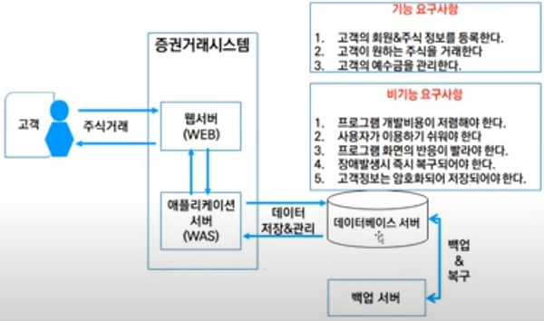

# IT & CS

### 메모리

대역폭 : 메모리 동작 속도, 높을수록 성능이 좋음

ECC : 메모리 오류 검사/수정 여부

REG(Registered) : 메인보드 내 RAM의 장착 슬롯 거리 차이에 따른 신호 왜곡 최소화 여부

### 디스크

RPM : 디스크 회전 속도, 주로 5400/720/10000/15000 RPM으로, 높을수록 성능이 좋아지지만, 발열, 진동, 소음이 증가할 수 있다.

HBA(Host Bus Adapter) 카드 : 서버와 외부 스토리지 사이에 위차하여 신호 전달을 중계 및 제어하는 입출력 어댑터이다. 주로 외부의 SAN(Storage area network), 스위치(switch) 및 스토리지(storage)와 연계하기 위해 서버 하드웨어에 장착

HyperThreading : 하나의 CPU core를 논리적으로 2개로 인식시켜 개별적으로 스레드를 처리하도록 함으로써 CPU 성능 향상

### 가상화

- Type-1 - Hypervisor가 하드웨어 상에서 Host 운영체제 도움 없이 직접 실행되는 방식
  
    전가상화 : Full virtualization, 하드웨어를 완전히 가상화하는 방식, Guest 운영체제에 별다른 수정이 필요없지만, Hypervisor가 모든 명령을 중재하므로 다소 성능이 저하될 수 있다.
  
    반가상화 : 하드웨어를 일부만 가상화하는 방식, 전가상화에 비해 성능은 빠르지만 운영체제 커널(kernel) 수정이 필요한 방식

- Type-2 - 하드웨어에 Hypervisor가 설치된 Host 운영체제 위에서 일반 프로그램들과 동일하게 실행되는 방식
  
  - VMWare Workstation, Oracle VirtualBox

HCI 구성 : 서버, 스토리지, 네트워크 및 가상화 솔루션을 모두 통합하여 소프트웨어 중심적으로 구성

- 클라우트 컴퓨팅이 대표적인 구성

Page / Block : 파일 시스템이 디스크나 메모리에서 데이터를 읽고 쓰는 논리적 단위

- 주로 크기는 하나당 4KB, 8KB, 16KB가 된다.

3-tier 시스템에서 WEB layer 뿐만 아니라 WAS같은 application layer에도 Load Balancing을 적용할 수 있다.

idle process : 운영 체제가 실행하는, while loop안에서 halt라는 어셈블리어 명령을 수행하는 프로세스

- 입력 대기 상태로 user space에 속한 상태
- 따라서 idle 같은 유휴 상태는 전원 손실을 일으킨다. 그래서 요즘 운영체제는 halt가 아닌 간단한 코드를 실행시키고 일정 시간이 지나면 시스템 콜을 실행하여 하드웨어 전원을 낮추거나 중단하는 형태로 발전하고 있다.

**32bit or 64bit** : CPU가 데이터를 처리할 때 사용하는 레지스터의 크기를 의미

- 1bit : 0과 1 두 가지로 표현되는 전기 신호의 가장 작은 단위

fork() - 기존 프로세스에서 새로운 PID의 자식 프로세스를 하나 더 생성

exec() - 새로 생성된 프로세스에 기존 프로세스의 PID가 적용되고 그대로 덮어 쓰여짐

**런타임(Runtime)** - 어떤 프로그램이 메모리나 CPU, 시스템 변수 및 환경 변수 등 필요한 시스템 자원을 할당 받고 그것을 이용하여 어떤 처리를 하고 있는 동작

- 런타임 오류 : syntax error와 같은 컴파일타임 오류와는 다르게 프로그램이 자원을 할당받고 실행 중에 오류가 발생할 때 이를 런타임 오류라고 부른다.
  ex) Null 참조 오류, 메모리 부족
- 런타임 환경 : RTE - 해당 프로그램이 실행되기 위해 시스템 자원에 접근할 수 있도록 해주는 **실행 환경,** 운영체제 자체에서 제공하기도 하고 운영체제 위에서 작동하는 소프트웨어가 제공하기도 한다.

과거의 IT 자산의 주된 대상이었던 물리적인 하드웨어 중심에서 가상화나 클라우드 서비스의 등장으로 소프트웨어 자산의 가치가 증가했다.

요구 사항 정의 → 도입 → 운영 → 폐기

프로세스 문서 정의 필요

IT 자산 생명 주기와 자산 관리 주체 파악 필요

자산을 사용하다 서비스를 중지하고 다른 서비스로 사용 전환을 할 수 있다. 서비스 중지된 해당 자산에 대한 수요를 조사하고 재사용할 수 있다는 것

**Infra 아키텍쳐 설계**

- 요구사항 명세서 분석
- 비즈니스 품질 목표, 시스템 요구사항 등

### CPU Architecture

### x86

- Intel 기반 32bit CPU 입니다.
- 현존 하는 PC 프로그램 대부분이 이 아키텍처를 지원 합니다.
- Windows, Linux, Mac OS (BigSur 까지)

### x86_64 (amd64)

- amd64 라고도 합니다.
- Intel 기반 64bit CPU 이며, x86과 호환 됩니다.
- **사실상 AMD가 만들었는데 Intel 과 크로스 라이센싱 하여 둘 다 씁니다.**
- Windows, Linux, Mac OS (BigSur 까지)

### arm

- arm 기반 32bit CPU 입니다.
- x86 과 아예 달라서 둘이 전혀 호환이 안됩니다.
- Linux, Mac OS (Monterey 부터), Android, iOS, 기타 모든 쪼그만 기기에서 성능 내야하는 경우 (공유기도 해당)

### arm64 (arm64/v8)

- arm 기반의 64bit CPU 입니다.
- 32bit arm 과 호환 됩니다.
- Linux, Mac OS (Monterey 부터), Android, iOS, 기타 모든 쪼그만 기기에서 성능 내야하는 경우 (공유기도 해당)