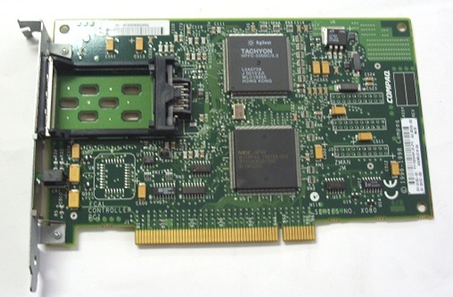

# AWS Solutions Architect Associate

## <IAM>

**Root 사용자는 계정을 생성할 때에만 사용하며, 그 외 공유되거나 사용되어선 안된다.**

IAM 사용자는 여러 개의 그룹에 속할 수 있고, 여러 개의 그룹에 적용된 정책을 상속받을 수 있다.

**IAM 정책** : AWS 리소스에 대한 액세스를 허용하거나 거부하는 규칙을 정의하는 JSON 문서

- **명시적인 허용(Allow) 정책이 있지 않은 이상, 묵시적 거부가 기본으로 설정된다.**
- 기반
    - Identity-based 정책(자격 증명 기반 정책) - 사용자, 그룹, 역할에 연결되는 정책 +신뢰 정책
    - Resource-based 정책(리소스 기반 정책) - 리소스에 직접 연결되는 정책
- 유형
    - 관리형 정책 - AWS에서 미리 정의된 정책
    - 인라인 정책 - 사용자, 그룹, 역할에 직접 포함되는 정책

**IAM 정책 구조**

- Effect : 특정 API 접근 허용 여부
- Principal : 특정 정책이 적용될 계정, 사용자, 역할
- Action : 정책이 적용되는 API 목록
- Resource : Action이 적용되는 리소스
- Condition : 선택사항

IAM 사용자 패스워드 정책을 직접 설정할 수 있다.

- 최소 패스워드 길이 설정
- 패스워드 형식(문자, 숫자 등)
- IAM 사용자가 패스워드를 직접 수정할 수 있는가?
- 패스워드 만료 기한 설정
- 이전 비밀번호 재사용 방지

MFA 기기 종류

- 가상 MFA 기기
ex) Google Authenticator, Authy - 휴대전화에서만 가능
- Universial 2nd Factor(U2F) Security Key : 유비코라는 서드 파티에서 유비키라는 물리적인 키 형태로 제공하여, 다수의 루트 계정과 IAM 사용자를 지원
- 젬알토라는 서드 파티에서 제공하는 MFA 기기, 미국 정부에서 사용하는 AWS GovCloud용 MFA 기기인 SurePassID

AWS CLI/SDK - **액세스 키**, **비밀 액세스 키**를 사용

- 개인 로컬 환경에서만 권장되며, 인스턴스에 절대 설정해선 안된다.
- 액세스 키, 비밀 액세스 키를 절대 타인과 공유해서는 안된다.

AWS CLI : 로컬에서 원격 AWS 리소스를 관리하기 위한 명령줄 인터페이스로 모든 command가 aws로 시작하며, 스크립트를 만들어 작업을 진행할 수도 있다.

- aws configure → 액세스 키 입력, 비밀 액세스 키 입력 → 가장 가까운 리전 코드 입력

AWS SDK : 프로그래밍 언어에 따라 개별적으로 존재하는 라이브러리 집합으로 AWS API를 연동하여 애플리케이션을 개발하기 위한 소프트웨어 개발 키트를 의미

- JavaScript, Python, PHP, .NET, Ruby, Java, Go, Node.js, C++

AWS CloudShell : 별도의 로컬 환경 없이 AWS 관리 콘솔에서 command를 입력하여 리소스를 관리할 수 있는 서비스

- 특정 리전에서만 가능한 서비스
- 파일을 작성하면 CloudShell을 재시작해도 해당 파일이 남아있으며, 로컬로 다운받을 수 있다.
- 반대로 로컬에서 작성한 파일을 CloudShell로 업로드할 수 있으며, 스크립트를 작성해서 업로드 한 다음 실행시키는 식으로 작업을 진행할 수도 있다.

IAM 보안 도구

- IAM Credentials Report - 계정 내 IAM 사용자에 대한 보안 인증 보고서 다운로드
- IAM Access Advisor(액세스 관리자) - 사용자가 액세스할 수 있는 서비스와 마지막 액세스 시간을 확인할 수 있다.
- IAM Access Analyzer - AWS 리소스에 대한 Public 및 교차 계정 액세스를 분석하고, 잠재적인 보안 위험 식별

**IAM 역할 :** 인스턴스 같은 리소스에 적용하여 AWS API에 접근하기 위한 임시 권한

- SCP, IAM 사용자 정책을 포기하고 취한다.
- AWS 서비스 역할, 교차 계정 역할, ID 공급자 역할

## <EC2>

- EC2 provisioning시 bootstrap command는 root 계정으로(sudo를 붙여) 실행된다.
- 인스턴스가 배포된 호스트에서 예기치 않은 하드웨어 오류가 발생할 경우 새 호스트에서 인스턴스를 자동으로 다시 시작한다.
- **종료 방지**, **중지 방지** 설정 가능

**인스턴스 유형 표시** ex) c5.xlarge

- c : **인스턴스 패밀리(Class)** - CPU가 좋거나, I/O에 적합하거나, GPU가 장착되어 있거나 등 용도별 분류
- 5 : **인스턴스 세대** - CPU 칩의 세대가 올라감에 따라 인스턴스 세대 또한 증가
- xlarge : **인스턴스 크기**, 커질수록 용량 및 가격 증가

**인스턴스 유형**

- 범용 인스턴스 : 컴퓨팅, 메모리, 네트워킹 리소스를 균형 있게 제공
    - 애플리케이션, 게임, 엔터프라이즈 애플리케이션용 백엔드, 중소 규모 DB, Code Repository 등
- 컴퓨팅 최적화 인스턴스 : 고성능 프로세서를 활용하는 배치 처리 워크로드에 적합
    - 고성능 웹 서버 및 게임 서버, 미디어 Transcoding, ML 등
- 메모리 최적화 인스턴스 : 메모리에서 대규모 데이터 집합을 처리하는 워크로드에 빠른 성능 제공
    - 고성능 DB, 많은 양의 비정형 혹은 데이터 처리 워크로드(In-Memory DB), 분산형 웹 캐시 등
- 엑셀러레이티드 컴퓨팅 인스턴스 : 하드웨어 엑셀러레이터 또는 코프로세서로 일반적인 CPU보다 더 효율적으로 기능 수행
    - 그래픽 App, 스트리밍, AI/ML 등
- 스토리지 최적화 인스턴스 : 스토리지 내 대규모 데이터 집합을 저장하고 Disk I/O에 최적화
    - DW, RDB/NoSQL, OLTP(Online Transaction Processing) 시스템, In-Memory DB 등

**인스턴스 상태에 따른 요금**

| pending | 인스턴스는 running 상태로 될 준비를 하고 있습니다. 인스턴스는 시작되거나 stopped 상태 이후에 시작되면 pending 상태로 들어갑니다. | 미청구 |
| --- | --- | --- |
| running | 인스턴스를 실행하고 사용할 준비가 되었습니다. | 청구 |
| stopping | 인스턴스를 중지할 준비를 하고 있습니다. | 미청구 |
|  | 중지 상태로 최대 절전 모드로 전환할 준비를 하고 있습니다. | 청구 |
| stopped | 인스턴스가 종료되고 사용이 불가합니다. 언제든지 인스턴스를 다시 시작할 수 있습니다. | 미청구 |
| shutting-down | 인스턴스가 종료할 준비를 하고 있습니다. | 미청구 |
| terminated | 인스턴스가 영구적으로 삭제되었으며 시작할 수 없습니다. | 미청구 |

**보안 그룹**

- 여러 인스턴스에 적용 가능하고 하나의 인스턴스는 여러 보안 그룹을 갖고 있을 수 있다.
- 특정 리전과 VPC내에서만 유효
- Default로 인바운드는 모두 차단되고, 아웃바운드는 모두 허용된다.
- Mac, Linux, 10버전 이상의 Windows에서 SSH 제공

보안 그룹 규칙을 설정할 때 Source 대상을 특정 보안 그룹으로 지정하여 규칙을 설정할 수 있다.

EC2 Instance Connect : 사내 방화벽, 개인 방화벽 등의 문제로 로컬에서 SSH 연결을 할 수 없을 때, AWS 콘솔에서 EC2에 SSH로 접속할 수 있도록 지원

- 임시 SSH key를 생성하여 연결하므로 편리하다.

**인스턴스 구매 옵션**

On-Demand : 1분 이후에 초 단위로 과금되는 일반 종량제 인스턴스

Saving Plan : 달러 단위로 특정한 사용량을 약정하여 온디맨드와 비교하여 최대 72%까지 절약

- 가용영역과 인스턴스 유형 및 크기, OS, 테넌시에 관계없이 1년 또는 3년의 약정으로 구입
- AWS Fargate, AWS Lambda 사용량에도 적용 가능

예약 인스턴스 :  **꾸준한 상태**의 워크로드나 **사용량이 예측 가능한** 워크로드에 적합

- Saving Plan과 동일하게 1년 또는 3년의 약정으로 구입하고 최대 72%까지 절약
- **표준** 예약 인스턴스 : **특정 인스턴스 유형 및 크기 및 실행 리전**에서 안정적으로 애플리케이션을 운영해야 하는 경우, **예약 인스턴스 마켓플레이스에서도 판매할 수 있다.**
- **컨버터블** 예약 인스턴스 : **다른 인스턴스 유형이나 가용 영역으로 변경 실행할 가능성**이 있는 경우, 그러나 예약 인스턴스 마켓플레이스에서 판매할 수 없다.
- 약정 기간 종료 시 일반적인 On-Demand 요금 부과

**스팟 인스턴스** : 미사용 Amazon EC2 컴퓨팅 용량을 온디맨드 가격의 최대 90%까지 할인받아 사용할 수 있다.

1. 스팟 인스턴스에 지불할 수 잇는 **최대 스팟 가격**을 정의
2. 인스턴스의 스팟 가격이 최대 가격보다 낮으면 해당 인스턴스를 유지
3. 스팟 가격이 정의된 최대 가격을 초과하면 2분의 유예 시간 내 아래 중 한 가지가 진행
    1. 인스턴스를 중지했다가 최대 가격 아래로 내려가면 다시 시작하여 작업을 재개
    2. 인스턴스를 종료하고 최대 가격 아래로 내려가면 새로운 인스턴스를 시작하여 작업을 재개
- 요청 방식
    - 일회성 요청 : **스팟 요청**이 완료되는 즉시 인스턴스가 시작되고, 기존의 요청은 사라져 중지되어도 다시 시작되지 않음
    - 영구 요청 : 요청한 만큼의 스팟 요청이 사라지지 않고, 스팟 인스턴스가 중지되면 이후 요청한 만큼 다시 시작
    따라서 스팟 인스턴스를 영구 종료하려면 **요청을 삭제한 다음 스팟 인스턴스를 종료**해야 한다.
- **시작 및 종료 시간이 자유롭거나 중단을 견딜 수 있는 워크로드에 적합**
- 최대 가격을 평균 워크로드보다 조금 높게 설정하여 일반 온디맨드 가격보다 더 저렴한 가격으로 중단 없이 서버를 운영하기도 한다.
- **스팟 플릿** : 다양한 인스턴스 유형, OS, AZ내에서 적합한 **런치 풀**을 선택하여 예산 및 용량 내에서 **스팟 인스턴스 세트(+ 온디맨드 인스턴스)** 정의
    - 최저 가격 : 가장 낮은 가격의 풀에서 인스턴스를 시작
    - Diversified : 정의한 모든 런치 풀에 인스턴스가 분산되므로, 가용성과 긴 워크로드에 적합
    - 용량 최적화 : 원하는 인스턴스 수에 맞는 최적의 용량을 가진 풀을 갖게 된다.
    - 가격 용량 최적화 : 사용 가능한 용량이 가장 큰 풀을 선택하고, 그 중 가격이 가장 낮은 풀을 선택하는 전략으로 대부분의 워크로드에 가장 적합한 선택
- ~~스팟 블록 : 스팟 인스턴스를 회수하는 것을 방지~~

전용 호스트 : **다른 고객과 공유하지 않고** 전용 물리적 Host를 사용 (+ 낮은 수준의 하드웨어 관리 가)능

- 기존 **소켓당, 코어당 또는 VM당 소프트웨어 라이선스를 사용**하여 라이선스 규정 준수를 유지할 수 있다.
- 전용 인스턴스 : 자신의 전용 인스턴스에 인스턴스를 실행하고, 계정 내 타 인스턴스와 하드웨어를 공유한다. 하드웨어에 대한 통제 권한은 없다.

용량 예약 : 특정 가용 영역에서 원하는 기간 동안 온디맨드 인스턴스 용량을 예약

- 언제든 예약 및 취소 가능
- 청구 할인 X
- 인스턴스 실행 여부에 무관하게 온디맨드 요금 부과

AWS는 IPv6도 지원하며, IPv6는 사물인터넷 등 광범위하게 쓰인다.

계정당 EIP는 5개까지만 지원하며, EIP를 사용하는 것은 권장되지 않는다. 대신 임의의 공인 IP를 써서 DNS 이름을 할당하는 것이 좋다.(Route 53)

**EC2 배치 그룹** : 어떤 방식으로 EC2 인스턴스를 배치할 것인가에 대한 전략 정의

- Cluster : **모든 인스턴스가 같은 가용영역에 위치**하여, 서로 간 10Gbps의 대역폭으로 통신이 가능한 구조
    - ex) 빠른 네트워킹으로 작업을 빠르게 완료해야 하는 Big Data, 컴포넌트간 빠른 통신이 가능해야 하는 애플리케이션 등
- Spread(분산) : 모든 인스턴스가 서로 다른 하드웨어에서 구동되어 위험 최소화, 하지만 배치 그룹의 **가용 영역 당 7개의 인스턴스**로 제한되어 규모가 한정적인 애플리케이션에서만 쓸 수 있다.
    - ex) 고가용성을 보장해야 하는 애플리케이션
- Partition(분할) : 각 파티션은 각각의 전원과 물리적 컴포넌트를 가진 랙의 개념이다. **가용 영역 당 7개의 파티션**을 쓸 수 있으며, 최대 수백개의 EC2 인스턴스를 여러 파티션에 분산 배치하여 특정 랙의 장애로부터 고가용성을 보장받는다. 또한 각각의 인스턴스가 어떤 파티션에 배치되어 있는지에 대한 메타데이터 서비스를 운영하여 이 정보에 엑세스할 수 있다.
    - ex) Kafka, Hadoop, Cassandra 등을 사용하는 빅 데이터 애플리케이션
- **배치 그룹을 먼저 생성한 다음, 인스턴스 생성할 때 배치 그룹 선택**

**ENI** : VPC의 논리적 구성 요소이며 가상 네트워크 카드를 의미

- 하나의 기본 IPv4(eth0)와 하나 이상의 보조 IPv4(eth1..)를 갖는다.
- 하나의 EIP 혹은 Public IP
- 하나 이상의 보안 그룹 연결
- EC2 인스턴스와는 별도로 생성하여 붙였다가, 장애 조치를 위해 인스턴스에서 이동시킬 수 있다.
- 특정 AZ에만 종속
- 직접 생성하여 붙인 ENI는 해당 인스턴스가 종료되어도 사라지지 않는다.

**EC2 Hibernate 모드** : 절전 모드가 가능한 인스턴스로 시작하는 옵션, 인 메모리 데이터를 그대로 보존할 수 있다.(인스턴스 부팅이 더 빨라질 수 있다.)

1. **인 메모리 데이터가 루트 EBS 볼륨에 기록되기 때문에 루트 EBS 볼륨은 암호화되어야 하고, 용량도 메모리 데이터를 저장하기에 충분해야 한다.(인스턴스 스토어 X)**
2. 인스턴스가 절전 모드가 되면 인스턴스는 중지되고, **RAM의 내용은 EBS 볼륨에 덤프된다.**
3. 인스턴스가 종료되면 RAM 또한 사라지게 된다.
4. EBS 볼륨에는 여전히 덤프된 RAM 데이터가 존재하므로, 인스턴스를 다시 시작하면 디스크에서 RAM 데이터를 불러와 메모리에 연동한다.(종료 시 삭제 옵션을 ‘아니오’로 설정해야 한다.)
- 최대 절전 모드에서는 연결된 EBS 볼륨 및 EIP에 대해서만 비용을 지불하고 시간당 요금이 없다.
- 지원하는 인스턴스 패밀리가 다양하고, 최대 150GB의 RAM 크기에서 지원
- 베어 메탈 인스턴스에는 적용할 수 없다.
- Linux, Windows등 다양한 OS AMI에서 지원
- 온디맨드, 예약, 스팟 등 모든 인스턴스 유형에서 사용 가능
- 최대 60일까지만 절전 모드 가능

인스턴스 메타데이터 검색 - EC2 인스턴스를 사용하여 http://169.254.169.254/latest/meta-data/ URL에 액세스

## <Storage>

**인스턴스 스토어** : 인스턴스 시작 시 제공되는 볼륨으로, 호스트에 직접 물리적으로 연결이 되어 있으므로 인스턴스를 중지하거나 종료하면 이 스토어 볼륨에 작성된 데이터가 삭제

- 물리적으로 연결된 디스크이니만큼 **I/O 성능(IOPS)**이 좋다.
- 캐시 혹은 임시 데이터 저장

루트 EBS Volume : 인스턴스 생성 시 기본으로 제공되는 EBS 볼륨 디바이스, 인스턴스 삭제 시 함께 삭제되는 것이 default이나 그렇지 않게 비활성화할 수 있다.

**EBS** : 인스턴스 호스트에서 드라이브를 분리한 개념의 블록 스토리지

- 네트워크 드라이브(**NAS**) - 인스턴스와 네트워크 통신을 하므로 약간의 latency가 있음
- **일부 EBS 유형에서 다중 인스턴스 연결 가능
[io1/io2 제품군은 같은 가용 영역 내 여러 인스턴스에 연결하여 동시에 읽고 쓰는 것이 가능하다.](https://www.notion.so/io1-io2-cd7a9c8214ab40db989427269b9cb4da?pvs=21)**
- **하나의 인스턴스에 하나 이상의 EBS 연결 가능**
- 특정 AZ에 고정되어 **해당 AZ의 인스턴스들에만 연결 가능**
- 스냅샷을 찍어 다른 가용 영역과 리전에 이동 가능 - **재해 복구에 유용하다**
- RAID 0을 사용하여 인스턴스 리소스 활용도를 극대화할 수 있다.

**EBS 백업은 I/O를 사용하므로 Traffic이 많은 시간에는 하지 않도록 한다.**

**EBS 볼륨 유형** : 크기, 처리량, IOPS를 기준으로 정의

- gp2/gp3 (SSD) : 다양한 워크로드에 대해 가격과 성능의 균형을 맞추는 범용 SSD - 일반적으로 인스턴스를 프로비저닝할 때 사용되는 볼륨
    - 비용 효율적이고 저지연
    - 1G ~ 16TiB
    - gp3의 경우 최대 16000 IOPS까지 Disk Size와 독립적으로 설정 가능하고, gp2의 경우 기가바이트당 3 IOPS 증가
    - 가상 데스크톱, 개발 및 테스트 환경, **빈번한 I/O가 발생하는 DB**에 사용
- io1/io2 (SSD) : 가장 높은 성능의 SSD 볼륨으로, 처리량이 많거나 저지연을 필요로 하는 워크로드에 적합
    - io1 : 4G ~ 16TiB, 최대 32000 IOPS(Nitro 인스턴스의 경우 64000)
    - io2 : 4G ~ 64TiB, 기가바이트당 1000 IOPS
- st1(HDD) : 저비용 HDD 볼륨으로, 자주 접근하고 처리량이 많은 작업을 위해 설계
    - Big Data, DW, 로그 처리
    - 최대 500MiB/s, 500 IOPS
- sc1(HDD): 가장 저렴한 HDD 볼륨으로, 접근 빈도가 적은 워크로드를 위해 설계
    - 최대 250MiB/s, 250 IOPS
- 상기 HDD 볼륨 : 125GiB ~ 15TiB 용량 지원
- gp2/gp3, io1/io2 유형만 부트 볼륨(OS의 ‘/’가 실행되는 위치)으로 사용될 수 있다.

io1/io2 제품군은 같은 가용 영역 내 여러 인스턴스에 연결하여 동시에 읽고 쓰는 것이 가능하다.

- 최대 16개의 인스턴스에 연결 가능
- xfs, ex4 등 파일 시스템이 아닌 **cluster-aware 파일 시스템**을 사용해야 한다.

**EBS 암호화**

- 저장 데이터가 볼륨 내부에 암호화
- **인스턴스와 볼륨 간 오고 가는 데이터도 암호화**
- **일반 스냅샷에서 암호화된 스냅샷을 복사할 수 있고, 해당 복사된 스냅샷으로 생성된 EBS 또한 암호화되어 있다.**
    - 암호화되지 않은 볼륨의 스냅샷 원본을 암호화할 순 없다.
    - 암호화되지 않은 스냅샷으로 암호화된 볼륨을 생성할 수 있다.
- 지연 시간이 거의 없고, KMS에서 암호화 키를 생성해 AES-256 암호화 표준을 갖는다.
- 암호화 기본 제공 옵션을 리전별로 설정할 수 있다.

EBS Snapshot 주요 기능

- EBS Snapshot Archive : **S3** Archive tier를 통해 이동해서 복원하는데 24~72시간 소요
- Recycle Bin for EBS Snapshots : 실수로 스냅샷을 삭제했을 때 즉시 삭제되지 않고 휴지통에 1일~1년간 보관
- Fast Snapshot Restore : 스냅샷을 완전 초기화해 첫 사용에서의 지연 시간을 최소화
    - 스냅샷이 아주 크거나, EBS 혹은 EC2 인스턴스를 빠르게 초기화해야 할 때 유용
    - 고비용 기능

**AMI**

- 소프트웨어, 설정, OS, 모니터링 시스템을 추가하여 자체적으로 AMI 이미지 구성
- 다른 리전으로 복사해서 글로벌 인프라 구축에 활용 가능
- EBS 스냅샷처럼 휴지통을 사용하여 삭제된 AMI 복원 가능
- 다른 사람이 구축한 이미지를 MarketPlace에서 구매하여 사용할 수 있다.
1. 인스턴스를 실행하고 직접 시스템을 customizing
2. 인스턴스를 중지해 데이터 무결성 확보
3. 중지된 인스턴스를 기반으로 AMI 이미지 생성(EBS 스냅샷 또한 생성된다.)

Golden AMI - 애플리케이션 + OS + 의존성 패키지 등을 포함한 배포용 마스터 AMI

**EFS** : 여러 가용 영역에 배치된 인스턴스에서 연결할 수 있는 **NFS** 파일 시스템 스토리지

- 고가용성
- **수천 대의 클라이언트 연결** 및 10GB/s 이상의 처리량 가능
- GB 단위 사용량에 따라 비용을 지불하기 때문에 **용량 제한이 없다. - PB 단위까지 확장 가능**
- 데이터 쉐어링, 웹 서비스, 신속한 반영이 필요한 콘텐츠 등
- **보안 그룹을 통해 EFS에 대한 접근 제어 가능**
- Linux 표준 파일 시스템 프로토콜인 **Posix**를 사용하므로 오직 Linux 기반 AMI하고만 호환
- KMS를 사용해서 EFS 드라이브에서 미사용 암호화 활성화 가능

**EFS 성능 모드**

- 범용(dafault) : 지연 시간에 민감한 사용 사례에 적합
- 최대 I/O : 지연 시간이 있으나, 처리량과 병렬성이 높아 빅데이터 애플리케이션/미디어에 적합

**EFS 처리량 모드**

- Bursting(기본값) : 파일 시스템이 성장함에 따라 50 ~ 100MiB/s정도로 확장
- Enhanced
    - Provisioned : 스토리지 크기에 상관없이 처리량을 자체적으로 설정, 필요한 처리량을 정확하게 알고 있을 때 사용
    - **Elastic** : 워크로드에 따라 처리량을 **자동으로** 조절, 워크로드 양을 예측하기 어려울 때 유용

**EFS 스토리지 클래스**

- Standard : 자주 접근하는 파일을 위한 클래스
- **EFS-IA** : 자주 접근하지 않는 파일을 위한 클래스, 비용이 검색할수록 증가하고 저장할수록 감소하는 유형
- Archive : 1년에 몇 번 정도로 거의 접근하지 않는 데이터를 위한 클래스로 50% 더 저렴하다.
- **수명 주기 관리를 설정하여** 스토리지 계층 간 파일을 자동으로 이동시킬 수 있다.

One Zone : 하나의 AZ에서만 지원하지만 기본적인 백업이 활성화되어 있는 옵션

- One Zone IA : 접근 빈도가 낮은 One Zone
- 개발 환경이 아닌 이상 별로 좋진 않음

**간혹 EFS를 mount한 인스턴스를 콘솔에서 생성하는 중 EFS와 nfs연동하기 위한 보안 그룹이 생성된 후 인스턴스에 정상적으로 추가가 되지 않는 경우가 있다. 이 때는 EC2 콘솔 메뉴 > 작업 > 보안 > 보안 그룹 수정 에서 보안 그룹을 추가해주도록 하자.**

## <ELB>

ELB와 결합이 가능한 서비스

- EC2
- Auto Scaling
- ECS
- **AWS Certificate Manager(ACM) : 인증서 관리 서비스**
- CloudWatch
- Route 53
- AWS WAF
- AWS Global Accelerator

ELB는 액세스 로그를 활성화할 수 있는 옵션을 제공한다.

ALB 지원 프로토콜 : HTTP, HTTPS, WebSocket, gRPC

NLB 지원 프로토콜 : TCP, TLS(Secured TCP), UDP

GWLB(Gateway Load Balancer) : L3에서 동작하므로 IP 프로토콜에서 동작

로드 밸런서의 보안 그룹은 외부 inbound를 모두 허용하는 방식으로 설정하고, 로드 밸런서에 연결된 인스턴스는 로드 밸런서의 보안 그룹이 source가 되는 트래픽만 허용하는 방식으로 설정해야 한다.

상태 검사(Health Check) : **대상 그룹** 레벨에서 연결된 인스턴스가 작동이 올바르게 되고 있는지 여부를 확인하기 위해 포트와 라우트 기반으로 특정 경로를 엔드포인트로 하여 상태 검사를 한다.

- ex) Path : /health
- 상태 확인 결과에 따라 정상적인 대상으로만 트래픽을 라우팅한다.

**ALB**

- L7
- [ELB 이름].region.elb.amazonaws.com 형식의 고정 hostname이 부여
- 동일 인스턴스 상의 여러 애플리케이션에 부하 분산
    - ECS 컨테이너 포함
- 로드밸런서 레벨에서 Redirection이 가능하다
    - ex) HTTP → HTTPS
- URL path, URL hostname, Query String 및 Header, Method 등에 따라 서로 다른 대상 그룹에 routing할 수 있어 MSA를 구축하는데 기여할 수 있다.
    - 리스너 규칙에서 설정할 수 있는데, 여러 규칙을 만족하는 Request가 들어올 경우 우선 순위가 높은 규칙에 따라 처리된다.

ALB를 사용할 경우, 연결된 애플리케이션 서버는 클라이언트의 IP를 알 수 없다. 클라이언트는 로드 밸런서의 사설 IP를 통해 서버에 들어가게 된다. 클라이언트의 IP 정보는 **X-Forwarded-For**라는 헤더에 들어있는데, 서버가 클라이언트의 IP를 알기 위해서는 이 헤더 정보를 직접 확인해야 한다.

ALB 대상 그룹

- EC2 인스턴스 혹은 ASG
- ECS task
- Lambda - HTTP Request가 **JSON event**로 해석되어 전달
- 특정 사설 IP 주소
    - 데이터센터 온프레미스 서버 포함

**NLB**

- L4
- 초당 수백만 건의 요청을 처리할 수 있을 정도로 우수한 성능을 보인다.
    - ALB는 애플리케이션 계층 기반 응답 또한 함께 처리하므로 ALB보다 latency가 덜하다
- **가용 영역별로 고정 IP를 갖거나 EIP를 할당할 수 있다.**
- 로드밸런서 레벨에서 리다이렉션이 가능한데, 프론트엔드에서 TCP로 받은 요청을 동일한 TCP로 백엔드에 리다이렉트하거나 혹은 **TCP 요청을 HTTP로 리다이렉트할 수 있다.**

NLB 대상 그룹

- EC2 인스턴스
- 특정 사설 IP 주소
    - 데이터센터 온프레미스 서버 포함
- ALB
    - ALB 앞에 배치하여 고정 IP를 설정할 수 있고, HTTP 트래픽을 처리하는 규칙까지 설정할 수 있다.

NLB는 대상 그룹이 TCP, HTTP, HTTPS 프로토콜 기반 Health Check(상태 확인)를 지원하며, 백엔드 애플리케이션이 지원하는 프로토콜에 따라 설정할 수 있다.

**GWLB**

- L3
- 방화벽, 침입 탐지 시스템, IDPS, 심층 패킷 분석 시스템 등을 수행하는 서드 파티와 함께 활용
    - 네트워크 계층에서 페이로드를 수정할 수도 있다.
- GENEVE 프로토콜, 6081 포트를 지원하는 서드 파티 가상 appliance에 트래픽 분산
1. **모든 트래픽이 GWLB를 경유하고, 서드 파티 가상 appliance에 트래픽을 분산**
2. **서드 파티 appliance로부터 응답을 받아 최종 애플리케이션에 전달**

GWLB 대상 그룹(**서드 파티 어플라이언스**)

- EC2 인스턴스
- 특정 사설 IP 주소
    - 데이터센터 온프레미스 서버 포함

Load Balancing 알고리즘

- 라운드 로빈 - 각 대상에 트래픽을 순차적으로 분산
- 가중 라운드 로빈 - 대상에 가중치를 부여하여 트래픽을 분산
- 최소 연결 - 가장 적은 수의 활성 연결을 가진 대상으로 트래픽 라우팅
- IP Hash - 클라이언트의 IP 주소를 기반으로 트래픽을 분산

고정 세션(Sticky Session) : **CLB, ALB**에 사용되며, **쿠키**를 활용하여 세션을 특정 인스턴스에 고정적으로 전달

- 쿠키가 만료되면 다른 인스턴스를 선정하여 고정적으로 전달한다.
    - 사용자 정의 쿠키 : 대상 그룹별로 개별적으로 지정하며, 애플리케이션이 필요한 어떠한 속성 정보도 포함 가능(단, 지정할 때 AWSALB, AWSALBAPP 같은 이름은 ELB에서 사용하는 약어에 가깝기 때문에 직접 정의 불가)
    - **Application 쿠키** : 로드 밸런서가 자체적으로 생성하고 쿠키 이름은 자동으로 AWSALBAPP이 된다.
    - **Duration-based 쿠키(기간 베이스 쿠키)** : 로드 밸런서가 자체적으로 생성하고 쿠키 이름은 AWSALB가 되며, 로드 밸런서가 자체적으로 생성하는 기간에 기반하여 만료된다.
- 애플리케이션 기반 쿠키는 만료 기간을 직접 정의할 수 있다.
- 개별 인스턴스의 EBS 볼륨이나 인스턴스 스토어 등에 세션 데이터를 저장하는 스테이트풀 애플리케이션의 경우 적합할 수 있다.

교차 영역(Cross Zone) 로드 밸런싱 : 모든 AZ에 걸친 인스턴스들에 트래픽을 골고루 분배

- 설정하지 않을 경우, 더 많은 인스턴스가 배치된 AZ에 좀 더 많은 트래픽이 분배된다.
- ALB에서는 default로 설정되어 있다.(대상 그룹 레벨에서 해제 가능) ALB에서 교차 영역 로드 밸런싱을 설정했을 경우 AZ간 데이터 이동에 비용이 들지 않는다.
- NLB, GWLB에서는 default로 설정되어 있지 않으며, 수동으로 설정할 경우 비용이 과금된다.

**ELB SSL 통신**

- ELB가 클라이언트와 SSL/TLS 통신을 주고받을 때 우선 HTTPS로 받고 백엔드 인스턴스에는 HTTP로 전달하지만, VPC에 속해있기 때문에 안전한 백엔드 통신이 가능하다.
- ELB는 X.509라는 SSL/TLS 인증서를 사용하고, 이러한 인증서들은 AWS ACM 이라는 서비스에 의해 관리된다.
- **리스너**는 HTTPS, TLS로 구성하고 기본 인증서를 지정, 필요 시 다중 도메인을 지원하기 위한 다른 인증서를 추가할 수도 있다.

**SNI : 여러 개의 SSL 인증서를 로드해 여러 개의 웹 사이트를 지원**

- 최초 SSL handshake 단계에 클라이언트는 SNI(Server Name Indication)를 써서 접속할 호스트의 이름을 지정할 수 있다. 그러면 그에 적절한 인증서를 찾아서 서비스한다.
- 새로운 프로토콜이기 때문에 모든 클라이언트가 지원하진 않는다.
- ALB, NLB, CloudFront에서만 지원한다.

**Connection Draining(연결 드레이닝)** : ELB에 연결된 인스턴스가 등록 취소 혹은 비정상의 상태에 있을 때, 어느 정도의 시간을 두어 다시 활성화할 수 있도록 하는 기능

- ALB, NLB - Deregistration Delay(등록 취소 지연)
- **기존에 연결된 클라이언트는 연결을 유지하여 요청을 완료할 수 있도록 한다. 그리고 De-registering 되고 있는 인스턴스에는 새로운 요청을 보내지 않는다.**
- 드레이닝 타임은 1~3600초로 설정할 수 있는데, default는 300초(5분)이다. 값이 0일 경우에는 드레이닝이 일어나지 않는다는 것을 의미한다.
    - 요청 시간의 길이에 비례하여 설정해야 한다.

## <Auto Scaling>

- ELB와 연결될 경우 새로 증설되는 인스턴스는 자동으로 로드 밸런서에 연결된다.
- Auto Scaling 기능 자체는 무료이며, 새로 생성된 리소스에 대한 비용만 과금된다.
- 최소 개수 ~ 최대 개수
- 상태 확인 - ASG 그룹의 인스턴스 상태를 주기적으로 확인하여 **정상적인 인스턴스로만 트래픽 라우팅**

**시작 템플릿** : AMI + 인스턴스 유형 + 사용자 데이터 + EBS 볼륨 + 보안 그룹 + 키 페어 + IAM 역할 + VPC 및 서브넷 정보 + ELB 정보 + etc..

- 여러 ASG 그룹에서 공유 가능
- 여러 버전의 템플릿을 가질 수 있다.

~~시작 구성 : ASG 그룹에서 인스턴스를 시작하는데 사용되는 템플릿을 의미~~

**Scaling 정책**

- 동적 스케일링
    - 타겟 기반 스케일링 : 특정 CloudWatch 매트릭에 대한 **목표값**을 설정하여 ASG가 자동으로 확장 또는 축소
    - 단순 또는 단계 스케일링 : **CloudWatch** 알람을 정의하여 알람이 트리거되면 단계적으로 인스턴스 수 확장 또는 축소
- 예약 스케일링 : 특정 날짜에 스케일링 예약
- 예측 스케일링 : 과거 패턴을 기반으로 예측치를 생성하여 이를 기반으로 스케일링 작업 예약

ASG를 Trigger하는 Metric 종류

- CPU 활용도
- 타겟당 요청 수
- 평균 네트워크 사용량 - 평균 네트워크 I/O
- CloudWatch에 설정한 기타 사용자 정의 매트릭

**Scaling Cooldowns** : 매트릭을 안정화하고 스케일링 이후 매트릭 변화를 용이하게 관찰하기 위해 스케일링이 완료한 이후 default로 5분 동안 쿨다운(휴지 기간)이 발생한다. 쿨다운 시간 동안에는 Scale out이나 Scale in이 발생하지 않는다.

- 쿨다운 시간까지 고려해서 스케일링을 위한 Ready-to-use AMI를 미리 준비하여 스케일링에 소요되는 시간을 줄이는 것이 권장된다.

## <RDS>

**RDS** : AWS 관계형 데이터베이스 서비스

- 지속적인 백업과 특정 시점 복원(PITR) 기능 지원
- 삭제 방지 활성화 가능
- 엔진 업그레이드를 위한 창구
- scale up and down  / scale out and in(Read Replica 추가 방식)이 둘다 가능
- 기본적으로 스토리지를 **수동적으로** 확장해야 하며, EBS Storage를 장착할 수 있다.
[**Multi-AZ 옵션에서** 최대 스토리지 한도를 설정하여 RDS Storage가 Auto Scaling될 수 있도록 할 수 있는 유연성을 지녔다.](https://www.notion.so/Multi-AZ-RDS-Storage-Auto-Scaling-3d01fca26fc54bcf9c9682f77998d379?pvs=21)
- KMS를 이용한 데이터를 암호화 및 볼륨에 저장, 데이터를 전송 및 수신하는 동안 암호화하는 옵션 지원
- 지원 엔진
1. Aurora
2. PostgreSQL
3. MySQL
4. MariaDB
5. Oracle Database
6. Microsoft SQL Server
7. IBM DB2

암호화되지 않은 RDS DB 인스턴스로는 암호화된 Read Replica를 생성할 수 없다. **암호화되지 않은 데이터베이스를 암호화하기 위해서는 RDS 스냅샷을 암호화된 스냅샷으로 복사하고 복원해야 한다.**

**RDS 보안**

- DB 인스턴스에 **SSL** 연결 사용 가능, 클라이언트 측에서 AWS TLS 루트 인증서 사용 가능
- AWS KMS로 관리되는 키를 통해 RDS **암호화**를 사용하여 RDS 인스턴스와 스냅샷 보호
- 보안 그룹, ACL 설정
- IAM 자격 증명에 따른 접근 제어
- MySQL과 PostgreSQL은 **IAM 데이터베이스 인증** 지원

**Multi-AZ 옵션에서** 최대 스토리지 한도를 설정하여 RDS Storage가 Auto Scaling될 수 있도록 할 수 있는 유연성을 지녔다.

- 할당된 스토리지의 여유 공간이 10% 미만일 경우
- 이러한 여유 공간 부족 상태가 5분 이상 지속될 경우
- 스토리지 한도가 수정된 지난 시간으로부터 6시간 이상 경과했을 경우

RDS 고가용성 및 성능 향상

- **Multi-AZ** : 여러 가용 영역에 걸쳐 Primary DB, **동기식 복제**의 Standby Replica를 두고, 데이터 정합성을 유지(동기화)하면서 **고가용성 및 재해 복구**를 ****보장하며 Primary DB에 이상 발생 시 Standby Replica가 Primary 로 승격
    - Primary와 Stanby 모두 하나의 DNS 이름을 가지므로 Primary에 장애가 발생해도 자동으로 Standby에 복구된다.
    - Standby 상태의 Replica는 Connection이 불가하다.
- **Read Replica** : Primary DB와 **비동기식 복제**의 Read Replica를 두어 **읽기(Select SQL) 워크로드를 적절하게 분산하여 성능 확장**
    - **비동기식 복제** : 데이터가 복제되기 전에 애플리케이션이 읽기 전용 복제본을 읽어 데이터를 얻는 식의 순서
    - **Read Replica가 메인 DB로 승격될 수 있다. 다만 장애 조치 목적으로 승격되는 것은 아니다.**
    - 다른 리전까지 **최대 15개**의 Read Replica를 가질 수 있다. 동일 리전 내 가용 영역 간 비동기식 복제에 대해서는 비용이 발생하지 않는다.
    - 프로덕션 애플리케이션이 Primary DB에서 처리하고, 데이터 조회용 서브 애플리케이션이 Read Replica에서 읽기 워크로드를 처리하는 사례가 주요

**Read Replica를 Multi-AZ로 구성할 수 있다. Read Replica에서 읽기 워크로드를 실행하는 서비스에 대한 재해 복구가 가능해야 하기 때문이다.**

RDS 생성 이후 Single-AZ에서 Multi-AZ로 전환이 가능하고, 전환할 때에도 downtime이 전혀 발생하지 않는다.

RDS Custom : **Oracle, MSSQL** 엔진에서만 가능한 서비스로, 데이터베이스 엔진 자체와 OS에 접근할 수 있는 권한을 가질 수 있는 서비스

- Configuration
- 패치 적용
- native 기능 활성화
- SSH/SSM Session Manager를 통해 RDS 인스턴스에 접근 가능
- 직접 커스터마이징하려면 **자동화 모드를 비활성화**하고, 문제가 발생할 것을 대비하여 데이터베이스 **스냅샷을 사전에 생성**해 놓아야 한다.

RDS 모니터링

- 향상된 모니터링 - OS 모니터링, RDS 프로세스, 하위 프로세스 등 RDS 인스턴스의 **에이전트**에서  프로세스 또는 스레드 관련 지표를 1초 단위로 수집하여 CloudWatch에 제공
- **RDS 이벤트 알림** - DB 인스턴스, 스냅샷, DB 파라미터 그룹 또는 보안 그룹, RDS 프록시, 사용자 엔진 버전 등 **DB 인스턴스 관련 이벤트 카테고리**를 subscribe하고 **SNS나 EventBridge와 통합하여 알림을 처리할 수 있다.**
- DB 로그 파일

**Aurora** : AWS에서 자체 개발한 RDB 엔진

- 상용 데이터베이스 비용의 10분의 1 수준
- **MySQL(3306 port)** 및 **PostgreSQL(5432 port)**과 호환
    - 상용 MySQL보다 5배, 상용 PostgreSQL보다 3배 높은 성능
- EBS 스토리지가 아닌 **물리적 공유 스토리지 내 클러스터 볼륨을 사용하여 3개의 가용 영역에 2개씩 총 6중 복제본 생성**
    - 6개 중 4개 이상 up이면 write에 문제가 없고, 6개 중 3개 이상 up이면 read에 문제가 없음
    - 블록 단위 peer to peer 복제를 통한 자가 복구
    - 100개의 볼륨에 걸쳐 스트라이프(striped) 형식으로 되어 있다.
    - Aurora DB 인스턴스와 독립적으로 구성되어 서로 api를 통해 비동기식 복제를 한다.


- **복제 지연 시간이 10밀리초 미만인 최대 15개의 Read Replica를 DB 클러스터에 포함된 가용 영역+ 타 리전에 배포 가능**
    - 적절한 수의 Read Replica가 유지될 수 있도록 하는 자동 스케일링을 설정할 수 있다.
    - **읽기 전용 엔드포인트**에 연결하여, Connection 단위로 Read 워크로드를 여러 복제본에 효과적으로 Load Balancing할 수 있다.
- 데이터 용량이 늘어날수록 공유 스토리지 볼륨도 처음 10G에서 시작해서 **최대 128TB까지** 자동 확장된다
- 지속적으로 S3에 데이터 백업
- Aurora Replica를 생성하면 자동으로 동기식으로 프로비저닝하고 유지 관리한다. 아울러 기본 DB 인스턴스에 장애가 발생하면 Aurora 복제본이 기본 인스턴스로 승격된다
    - Writer 엔드포인트는 기본 인스턴스에만 연결된다.
- RDS와 같이 DB 로그 파일, Enhanced Monitoring, RDS 이벤트를 통해 모니터링 가능

Aurora 고급 옵션 기능

- **사용자 정의 Endpoint** - 특정 작업에 적합한 Read Replica 인스턴스에만 연결할 수 있는 Custom Endpoint 생성이 가능하다.
- Serverless - 리소스 관리가 전혀 필요하지 않고 Proxy Fleet을 통해 접근할 수 있는 Aurora 서비스
용량 산정이 필요하지 않아, **워크로드를 예측할 수 없는 프로젝트에 적합**
- **Aurora Global** - 교차 리전 읽기 전용 복제본 생성 대신 사용할 수 있는 기능으로 하나의 Primary Region + 5개의 보조(Secondary) 읽기 전용 리전을 두고 Aurora를 운영하는 방식
    - replication 및 리전 간 데이터 복제 소요 시간 1초 이하
    - 보조 리전 당 16개의 읽기 전용 복제본을 둘 수 있다. 또한 Primary 리전에 장애가 발생할 경우 다른 보조 리전으로 failover(장애 조치)가 이루어져 Primary로 승격된다.
- Copy-on-write 프로토콜을 이용하여 **테스트용 Aurora DB 클러스터(Staging Aurora)를 원본 클러스터로부터 clone할 수 있다.** 스냅샷 생성 및 복원 방식보다 경제적이고 빠른데, 데이터가 공유 스토리지 기반에서 복제 및 격리되기 때문이다.
- **Aurora Auto Scaling** - CloudWatch와 함께 작동하여 사용자가 지정한 성능 매트릭의 변경에 따라 **replica를 자동으로 추가 및 제거**

Aurora 엔진과 호환되는 ML 서비스 : SageMaker, Comprehend

- 사기 행위 탐지, 광고 타겟팅, 감정 분석, 상품 추천 등에 활용 가능

RDS 백업

- 자동 백업 : 일일 전체 백업 및 5분 간격의 트랜잭션 로그 백업
    - 1 ~ 35일 사이로 백업 보존 기간 설정 가능, 0으로 설정 시 자동 백업 비활성화
    - 언제든 5분 전 상태로 복원 가능
    - PostgreSQL 엔진에서는 활성화 불가
- 수동 DB 스냅샷 : 수동으로 스냅샷을 생성하여 원하는 기간 동안 보관
    - 스냅샷 생성 및 보관은 DB 스토리지 비용보다 훨씬 저렴하므로, DB를 사용하지 않는 시간에는 스냅샷 생성 후 중지 및 삭제 → 재시작 시 스냅샷으로 복원하여 사용할 수 있다.

Aurora 백업

- 자동 백업 : 일일 전체 백업 및 1~35일 사이로 백업 보존 기간 설정 가능
    - 비활성화가 불가능, 언제든 어느 시점으로도 복원 가능
- 수동 DB 스냅샷 : RDS와 동일

복원 옵션

- **백업 혹은 스냅샷으로 새 DB 생성**
- S3 백업으로부터 복원
    - 온프레미스 DB 백업을 S3에 저장하였다가 새 RDS/Aurora 인스턴스에 복원

**감사 로그** 작성을 활성화하여 어떤 쿼리가 실행되고 있는지 등 정보를 DB에서 확인할 수 있도록 할 수 있다.

- 로그는 시간이 지나면 삭제되며, 장기 보관이 필요하면 CloudWatch Logs에 전송해야 한다.

**RDS 프록시** : 하나의 풀에 애플리케이션 연결을 집중하여 RDS 인스턴스에 대한 직접적인 연결을 줄여 성능을 향상시키는 **서버리스 관리형 서비스**

- 다수의 Lambda와의 연동에 효율적이고 흔히 사용
- Auto Scaling
- Multi-AZ
- Standby Replica로의 failover 시간을 66%까지 축소
- MySQL, MariaDB, PostgreSQL, Aurora 엔진에서 가능
- **IAM 인증을 통한 DB 연결**을 강제하고, 이 때 사용하는 자격 증명은 AWS Secrets Manager에 저장된다.
- 쿼리 재작성을 통해 SQL Injection 공격을 방지
- **쿼리 캐싱**
- 인터넷을 통해 연결할 수 없다. **오로지 VPC 내에서만 연결이 가능하다.**


**ElastiCache** : AWS의 In-Memory 데이터베이스

- Redis와 Memcached 두가지 관리형 서비스로 구분
    - **Redis** : 마치 RDS처럼 다중 AZ에 걸쳐 자동 FailOver와 **Read Replica**를 통한 고가용성을 지원하며, AOF 지속성을 이용한 데이터 내구성, 백업 및 복원 기능을 갖는다. Key-Value 구조 뿐만 아니라 **Sorted Sets, Hashes** 등 다양한 자료 구조를 지원하므로 등수 시스템 등 애플리케이션 기능을 구현하는데도 유용하다.
        - **대규모 데이터 처리 시 클러스터 모드를 활성화하여 샤딩 가능**
        - 단일 노드 Redis 엔드포인트 - 읽기 및 쓰기 모두
        - 다중 노드 Redis 엔드포인트 - 클러스터에 대한 모든 쓰기에 기본 엔드포인트를 사용하고 읽기 엔드포인트는 읽기 복제본을 가리킨다.
        - Redis 엔드포인트 - 클러스터 모드가 활성화된 상태에서만 사용 가능하며, 구성 엔드포인트에 연결하면 애플리케이션이 클러스터의 각 샤드에 대한 기본 엔드포인트와 읽기 엔드포인트를 검색할 수 있다.
        - 샤딩된 클러스터를 수직으로 확장하거나 축소할 수 있다.
    - **Memcached**
        - Key-Value 구조 데이터 모델
        - 클라이언트 측 **샤딩**
        - 고가용성, 영구 캐시, 백업 및 복원 기능 모두 지원하지 않는 멀티 스레드 아키텍쳐
        - 여러 샤딩에 캐시 분산, 데이터가 손실되어도 상관없을 때 사용한다.
- 용도
    - Read 워크로드 성능 향상을 위해 데이터베이스 위에 **In-Memory** 캐싱 계층을 추가하여 DB에 대한 직접적인 부하를 완화하는 용도(Cache Hit, Cache Miss)
    - **애플리케이션에 대한 사용자 세션 데이터를 캐시하는 스테이트풀 애플리케이션 구성**
    ex) 로그인 정보, 장바구니 등
- 실제로 접근하기 위해서는 애플리케이션 코드 수정이 필요하다.

ElastiCache 보안 기능

- Redis 한정으로 **IAM 인증** 지원
- AWS API 수준의 IAM 정책을 통한 보안 기능
- **Redis AUTH** - 비밀번호와 토큰, SSL을 통한 전송 중 암호화
- Memcached의 경우 SASL-based Authentication 지원
- 보안 그룹

ElastiCache 데이터 로드 방식

- 지연 로딩 : Cache Miss가 발생할 때만 모든 데이터를 캐시하는 방식으로, 데이터가 캐시에서 지체될 수 있다.
- Write through : DB에 데이터가 기록될 때마다 캐시에 데이터를 추가하거나 업데이트, 데이터 지연 X
- Session Store : TTL 기능을 사용하여 세션 데이터를 저장했다가 만료

## <Route 53>

SLD - Domain Registrar 서버

ex)Route 53, GoDaddy 

**Route 53** : 고가용성, 확장성을 갖춘 완전 관리형 SLD DNS 서비스 제공, AWS 고객이 DNS 레코드를 업데이트할 수 있다.

- Domain Registrar(도메인 구매) 서비스를 함께 제공
- 레코드
    - **도메인명, 레코드 종류, 값, 라우팅 정책, TTL을 포함한다.**
    - 레코드 종류
        - A - hostname을 IPv4 주소와 mapping
        - AAAA - hostname을 IPv6 주소와 mapping
        - CNAME - hostname을 다른 hostname과 mapping
            - **비 상위 도메인(Full Domain)에 대해서만 설정이 가능하다.**
        - NS - Hosted Zone(호스팅 존)에 대한 네임 서버로, DNS Query에 대해 이를 hostname이나 IP 주소 형태로 응답, **또한 트래픽이 도메인으로 라우팅되는 방식을 제어**
    - TTL - **Time To Live**, 클라이언트의 DNS Resolver에 해당 레코드를 캐시하는 시간의 길이
        - TTL이 길 경우, 변경된 레코드를 클라이언트가 확인하기까지 오래 걸릴 수 있고, 너무 짧을 경우 DNS 트래픽이 증가하여 과금이 증가할 수 있으므로 적절하게 설정해야 한다.
        - TTL은 Alias를 제외하고 의무적으로 설정된다.
- S3 bucket, CloudFront, EC2, ALB 등 호스팅

**라우팅 정책** : Route 53이 DNS Query에 응답하는 방식

- 단순 - 트래픽을 단일 리소스로 보내는 일반적인 방식, 여러 값을 응답받을 경우, 클라이언트가 무작위로 선택
    - 한 레코드에 여러 리소스를 mapping하므로 상태 검사 기능과 연계할 수 없다.
- 가중치 - 수치로 부여된 가중치를 %단위로 적용하여 리소스에 redirect
- 대기 시간 - 지연 시간을 Route 53에서 직접 측정하여 가장 짧은 가까운 리소스로 redirect
- **장애 조치** - Primary-Secondary 레코드를 각각 두고 Primary에 대한 상태 검사가 실패하면 자동으로 Secondary에 failover
    - Active - Passive
    - Pilot Light 혹은 Warm Standby 재해 복구에 활용할 수 있다.
    - 각각의 Primary, Secondary 레코드를 별도로 생성
- 지리적 위치 - 사용자의 지리적 위치에 기반하여 특정 호스트로 redirect
    - mapping되는 위치가 없을 경우를 위한 기본 레코드를 꼭 설정해야 한다.
- 지리 근접 라우팅 - 사용자나 리소스의 지리적 위치에 기반하여 트래픽을 redirect
    - 1 ~ 99 사이의 편향값을 주어 특정 지리적 위치의 리소스에 트래픽을 확장
    - -1 ~ -99 사이의 편향값을 주어 특정 지리적 위치의 리소스에 트래픽을 축소
    - 이러한 편향값은 한 리전에서 다른 리전으로 트래픽을 꼭 보내야 하는 상황에 유용하다.
    - 타겟이 AWS 리소스일 경우 리전을 특정하고, 온프레미스 같은 비 AWS 리소스일 경우 위도와 경도를 특정
    - Route 53 Traffic Flow 기능을 꼭 사용해야 한다.
- IP-based : **클라이언트의 IP CIDR 범위**를 정의하여 이를 기반으로 redirect
- 다중 값 : 여러 리소스에 트래픽을 redirect
    - 상태 검사 기능과 연계하면, Healthy 상태인 레코드(리소스)만 최대 8개까지 응답

**Alias** : 호스트 이름이 **특정 AWS 리소스**로 향하도록 할 수 있다.

- A 또는 AAAA 레코드 type으로 하나의 리소스에만 설정 가능, 그러나 **TTL은 적용 불가**
- 상위 도메인, 비 상위 도메인 모두에 적용 가능하다.
- 해당 레코드 자체적인 상태 검사가 가능하다
- 무료
- **S3 Static Website, CloudFront, API Gateway, Elastic Beanstalk, ELB, VPC Interface Endpoints, Global Accelerator, 특정 레코드를 대상으로 설정 가능**, EC2의 DNS 이름은 설정 불가!

**Hosted Zone** : 레코드의 컨테이너를 의미하며, 도메인과 서브도메인으로 가는 트래픽의 라우팅 방식 정의

- Public Hosted Zone : 인터넷으로 접근 가능한 공인 도메인에 대한 레코드 포함
- Private Hosted Zone : 인터넷에 공개되지 않는 도메인 이름을 지원, 즉 VPC 단위 내에서 유효한 도메인에 대한 레코드 포함
- 어떠한 유형의 Hosted Zone이든, 월 50센트 과금 - Route 53은 무료가 아니다.

**상태 검사(Health Checks)** : 리소스의 상태를 체크

- Public 리소스 엔드포인트에는 직접적으로 상태 검사 가능
- 엔드포인트 모니터링 방식
    - HTTP, HTTPS, TCP 등 프로토콜 지원
    - 방화벽에서 Route 53의 Health Checker에 대한 트래픽 허용 필요
    https://ip-ranges.amazonaws.com/ip-ranges.json
    - Health Checker의 18%이상이 Healthy 상태로 진단하면 Healthy 상태로 간주(상태 코드 2xx 혹은 3xx)
- Calculated Health Check 방식
    - 각각의 호스트를 향한 하위 상태 검사들을 OR/AND/NOT 조건으로 합산하여 진단
    - 최대 256개의 각각의 상태 검사 진단 구성 가능
    - 상위 상태 검사 통과 조건을 직접 설정 가능
- CloudWatch 알람을 모니터링하는 방식
    - **VPC내 Private 리소스(Private 호스팅 영역)에 대한 리소스의 상태 검사에 사용**
    - CloudWatch 메트릭을 생성하고 알람을 설정하여 그 알람 자체를 모니터링

타 도메인 레지스트라에서 구매한 도메인도 Route 53을 통한 DNS 서비스가 가능하다.

1. Route 53에서 Public Hosted Zone 생성
2. 도메인을 구입한 웹 사이트에서 NS 레코드나 네임 서버 정보를 업데이트

**5대 핵심 원칙**

- 비용 최적화
- 성능
- 보안성
- 내결함성
- 서비스 한도

## <신속한 애플리케이션 배포>

인스턴스 :

- Golden AMI - 애플리케이션 + OS + 의존성 패키지 등을 포함한 배포용 마스터 AMI
- 사용자 데이터 - 인스턴스 launching 시 저장할 데이터나 실행할 스크립트

RDS :

- RDS 스냅샷

EBS :

- EBS 스냅샷 - 디스크가 적절히 포맷되고, 필요한 데이터를 갖고 있다.

AWS Elastic Beanstalk : 애플리케이션 코드와 원하는 구성을 제공하면 EC2, ASG, ELB, RDS 등 리소스를 배포하여 원하는 환경 구성

- 용량 조정, 로드 밸런싱, 자동 조정, 애플리케이션 상태 모니터 등을 자동으로 처리
- 관리형 서비스로, 서비스 자체는 무료지만 사용되는 리소스에 대한 비용은 지불
- 버전별 애플리케이션 업로드 및 배포
- 환경 티어
    - 웹 서버 환경 : 클라이언트가 HTTP로 접근하는 웹 인프라
    - 작업자 환경 : 백엔드 작업 애플리케이션용
- Beanstalk를 통해 요청한 리소스는 **실제로 CloudFormation이 배후에서 생성한다.**
- 한 번에 모두, 롤링, 추가 배치를 사용한 롤링, 변경 불가능, 트래픽 분할 배포 전략

## <S3>

- 리전 단위 서비스
- **파일 : 객체, 디렉토리 : 버킷**
    - 버킷은 모든 리전, 계정에 걸쳐 고유한 이름을 가져야 한다.
- 키 + 값 쌍으로 구성된 메타 데이터를 포함한다.
- 보안과 수명 주기에 유용한 태그
- HTTP REST API 사용
- 저장공간을 무제한으로 지원하며, **최대 5TB 크기의 파일** 저장 가능
    - 하지만 크기가 5GB를 초과할 경우 멀티 파트 업로드는 의무이며, **성능 측면에서 100MB 이상의 파일도 멀티 파드 업로드를 하는 것이 권장된다.**
    멀티 파드 업로드 : 파일을 병렬 처리로 업로드
- **파일을 업로드할 때 자체적으로 권한을 설정하여 해당 객체에 대한 표시 여부와 엑세스 제어**
- **버전 관리 기능**을 버킷에서 활성화하여 변경 사항 추적할 수 있다.
    - 동일한 키를 업로드하여 덮어쓰는 경우 새로운 버전이 생성된다.
    - 버전 관리를 하면 객체 삭제 시 삭제 마커가 추가된다. 또한 이전 버전으로 Rollback이 가능하다.
    - 기존에 생성한 버킷의 버전 관리를 활성화하면 이전의 파일은 **null** 버전을 갖게 되고, 버전 관리를 다시 비활성화한다 해도 이전 버전이 삭제되지 않는다.
- 버킷명 하위의 객체의 이름이나 전체 경로가 해당 객체나 파일을 search할 **키**가 된다.
    - prefix + 객체 이름
    ex) 
    s3://my-bucket/**my_file.txt**
    s3://my-bucket/**my_folder1/another_folder/my_file.txt**
        - Prefix당 초당 3500회의 PUT, 5500회의 GET 요청을 처리할 수 있는 고성능을 가졌다. 따라서 Prefix(경로)를 적절하게 설정하여 read 처리를 분산할 수 있다.
- **요청자 지불** : 원래는 버킷의 소유자가 S3 용량과 네트워킹 비용을 지불한다. 하지만 요청자 지불을 설정하여 AWS에게 인증을 받은 요청자가(타 계정 혹은 기타 요청자) 대량 데이터를 다운로드 받을 때 그에 대한 비용을 지불하도록 할 수 있다.

**S3 네트워킹**

- 호스팅 방식의 액세스
    - 리전별 엔드포인트 대신 s3.amazonaws.com 엔드포인트를 사용하는 경우 Amazon S3는 기본적으로 모든 가상 호스팅 방식 요청을 미국 동부(버지니아 북부) 리전으로 라우팅한다.
    - Format:
        - http://[버킷명].s3.amazonaws.com
        - http://[버킷명].s3-aws-[리전].amazonaws.com
- 경로 방식 액세스
    - 경로 스타일 URL에서 사용하는 엔드포인트는 버킷이 있는 리전과 일치해야 한다.
    - Format:
        - 미국 동부(버지니아 북부) 리전 엔드포인트 : http://s3.amazonaws.com/[버킷명]
        - 리전별 엔드포인트, http://s3-aws-[리전].amazonaws.com/bucket
- CNAME으로 S3 URL을 사용자 지정할 수 있다. 이 때 버킷 이름은 CNAME과 동일해야 한다.

**S3 보안**

- 사용자 기반
    - IAM 정책 - 어떤 API 호출이 해당 IAM 사용자에게 허용되는가
- 리소스 기반
    - **버킷 정책** - 사용자 또는 다른 계정(교차 계정)에서 버킷을 접근할 수 있게 하는 정책
    - 객체 ACL - 보다 세분화된 보안이며 비활성화 가능
    - 버킷 ACL - 비활성화 가능
- 암호화 활성화 혹은 비활성화
    - SSE-S3
    - SSE-KMS
    - SSE-C
    - 클라이언트 측 암호화 : S3에 저장할 때 암호화하는 SSE와 달리, 클라이언트가 직접 데이터를 암호화한 다음 S3에 전송
    - 전송 중 암호화 강제 : SSL/TLS 프로토콜을 사용하며, 아래와 같이 버킷 정책을 명시하면 HTTP를 사용한 전송은 모두 차단된다.

```json
"Condition": {
		"Bool": {
				"aws:SecureTransport": "false"
		}
}
```

- DSSE-KMS : KMS 기반 이중 암호화
- S3에 IAM 정책을 적용할 때 특정 SSE 암호화를 헤더에 명시하지 않는 데이터를 차단하는 정책을 설정할 수 있다.

```json
"Condition": {
		"StringNotEquals": {
				"s3:x-amz-server-side-encryption": "aws:kms"
				//"s3:x-amz-server-side-encryption-customer-algorithm": "true"
		}
}
```

- IAM 정책에서 명시된 deny는 S3 버킷의 정책보다 우선시된다.
    - S3 정책이 허용해도 IAM 정책이 거부하면 접근 불가
- **기본적으로 객체는 이를 업로드한 AWS 계정이 소유권을 갖는다.**

**S3 복제**

- 비동기식
- CRR(Cross Region Replication) : 서로 다른 리전 간의 복제
- SRR(Same Region Replication) : 같은 리전 간의 복제
- 버전 관리가 활성화 되어 있어야 하고, 읽기, 쓰기 IAM 권한이 S3에 있어야 한다.
- 서로 다른 계정 간에도 복제 가능
- 복제 규칙을 생성하면 기본적으로 새로 업로드되는 객체만 복제된다. 하지만 S3 배치 작업으로 기존의 객체와 복제 실패 객체를 복제할 수 있다.
- **복제 규칙을 편집하여 삭제 마커 복제를 활성화할 수 있다.** 하지만 영구 삭제는 복제되지 않는다.
- 1번 버킷이 2번 버킷으로 복제되어 있고, 2번 버킷이 3번 버킷으로 복제되어 있다 해도, **1번 버킷의 객체가 3번 버킷으로 자동 복제되지 않는다.**

**Storage 클래스**

- S3 Standard
    - 자주 엑세스하는 데이터용
    - 최소 3개의 가용 영역에 데이터가 저장(리전 수준의 서비스)
    - 99.99% 가용성을 가지며, 이는 1년에 대략 53분정도 서비스 사용이 불가함을 의미한다.
        - ex) 빅데이터 분석, 모바일/게임 애플리케이션, 콘텐츠 배포 등
- S3 Standard-IA(Infrequent Access)
    - **자주 엑세스하지 않는 데이터**
    - Standard와 거의 동일하지만 저장 가격이 더 저렴하고 검색 가격은 더 높음
        - ex) 장기 보존 백업, 감사 데이터, 재해 복구 등
- S3 One Zone-IA
    - 단일 가용 영역에 저장
    - 자주 엑세스하지 않는 데이터
        - ex) 온프레미스 데이터 2차 백업, 재생성 가능한 데이터 저장
- 지능형 계층화(S3 Intelligent-Tiering) : **엑세스 패턴을 모니터링하여 티어 간 객체를 이동**
    - 액세스 패턴을 알 수 없거나 가변적인 데이터에 이상적
- S3 Glacier Instant Retrieval : 객체를 몇 밀리초 만에 빠른 검색이 가능
    - 최소 보관 주기 : 90일
- S3 Glacier Flexible Retrieval : 장기 보존 데이터를 보관하기 좋은 저비용 스토리지
    - 데이터를 1분 ~ 12시간 내 검색 가능
    - 최소 보관 주기 : 90일
- S3 Glacier Deep Archive
    - 1년에 한 두번 정도로 거의 접근하지 않는 장기 보존 데이터 보관에 적합
    - 가장 저렴한 클래스
    - 12 ~ 48시간만에 검색
    - 최소 3개의 가용 영역에 복제 및 저장(리전 수준의 서비스)
    - 최소 보관 주기 : 180일


**수명 주기 정책** : 객체 수명 주기 동안 객체에 대해 수행하도록 사전 정의된 작업을 구성할 수 있다.

- Prefix, 객체 태그, 현재 버전 혹은 이전 버전 객체를 대상으로 수명 주기 정책을 적용할 수 있다.
- **S3 Standard에서는 객체를 최소 30일 이상 보관해야 S3 Standard-IA, S3 One Zone-IA 클래스로 전환할 수 있다.**
- 우선 순위
    - 명시적 우선순위 미지정 시 - 여러 규칙이 동일 객체에 적용될 경우, 임의의 규칙을 선택하여 적용
    - 전환 vs 만료 - 만료 규칙이 우선 적용
    - 동일 액션 규칙 - 먼저 정의된 규칙이 우선 적용
- 일정 기간 지나면 클래스 이동 규칙
- 현재 버전 기간 만료 - 버전 관리가 활성화된 경우 삭제 마커 추가
- 이전 버전 영구 삭제
    - ex) 오래된 로그 등
- 만료된 삭제 마커 또는 완료되지 않은 멀티 파트 업로드 삭제


Amazon S3 분석(analytics) : Standard나 Standard IA 클래스에 한하여 클래스간 객체 이동 시기 결정에 도움을 줄 daily report를 제공해주는 서비스

**S3 이벤트 알림** : S3에서 일어나는 특정한 이벤트(생성, 제거, 복구, 복제)에 대한 알림

- 특정 객체에 대한 이벤트 filter 가능
- SNS나 SQS, Lambda에 몇초 혹은 몇분만에 전송 가능
    - 타깃에 **리소스 정책**을 적용하여 이벤트를 수신할 수 있도록 해야 한다.
    
    ```json
    "Condition": {
    	"ArnLike": {
    		"aws:SourceArn": "arn:aws::s3:::MyBucket"
    	}
    }
    ```
    
- **EventBridge**와 통합하여 이벤트 룰을 통해 18가지가 넘는 AWS 서비스에 이벤트를 전송할 수 있다.

**S3 성능 최적화**

- 적절한 Prefix 설정
- 멀티 파트 업로드
- S3 전송 가속화 : **엣지 로케이션을 통해** 해당 리전 버킷에 대한 **파일 업로드 및 다운로드 가속화**
    - 인터넷 기반으로 업로드/다운로드
- S3 바이트 단위 가져오기 : 특정 바이트 단위로 병렬 처리하여 데이터를 가져오는 방식
- 파일의 일부 가져오기
ex) 파일의 헤더만 가져오기
- ~~S3 Select & Glacier Select : 모든 객체 먼저 load한 다음 필요한 데이터를 검색하는 대신, 마치 SQL과 같이 객체 데이터를 filtering하여 데이터를 확인하는 방식으로 **성능과 비용 최적화**~~

**S3 Batch 작업** : S3 객체들에 대한 bulk 작업 수행

- 객체 리스트, 작업 action, 기타 파라미터 포함
- 작업 예시
    - 메타 데이터, 속성 수정
    - S3 버킷 간 객체 복사
    - 암호화되지 않은 객체 암호화
    - ACL, 태그 수정
    - S3 Glacier 티어로부터 객체 복원
    - 각 객체들에 대한 Lambda 함수 호출
- S3 Inventory를 사용하여 객체 리스트를 얻고 S3 Select를 통해 필터링하여 Batch 작업을 실행할 수 있다.

S3 Storage Lens : AWS Organization 및 멀티 리전 단위에서 S3 스토리지를 분석하고 최적화할 수 있는 대시보드를 생성하고 보고서로 집계할 수 있는 서비스

- 요약 매트릭 - 일반적인 인사이트 제공
- 비용 최적화 매트릭 - 스토리지 비용을 관리하고 최적화할 수 있는 인사이트
- 데이터 보호 매트릭 - 버전 관리 활성화, 교차 리전 복제 규칙 등 데이터 보호 모범 사례를 따르는지 여부 식별
- 접근 관리 매트릭 - 버킷의 소유권
- 이벤트 매트릭
- 성능 매트릭
- Activity 매트릭 : 요청 유형, 다운로드 바이트 수 등
- 상세 상태 코드 매트릭 : HTTP 상태 코드 인사이트
- 유료의 고급 매트릭의 경우, CloudWatch에 별도의 추가 비용 없이 발행할 수 있다.

CORS : Cross-Origin Resource Sharing

- Origin = scheme(protocol) + 호스트(도메인) + 포트
- 웹 브라우저 기반 보안 매커니즘으로, 헤더 내용을 참조하여 메인 오리진에 방문하는 동안 다른 오리진에 대한 요청을 허용/거부
- 같은 오리진 : **http://example.com**/app1 = **http://example.com**/app2
- 다른 오리진 : http://www.example.com ≠ http://other.example.com

**S3 CORS** : S3 버킷에 CORS 요청을 보낼 때 오리진에 대한 올바른 정보가 담긴 CORS 헤더를 전송해야 한다.

- CORS 편집에서 특정 오리진을 허용하거나 *(모든) 오리진을 허용
- 이미지, 미디어 등 데이터를 다른 오리진에 요청

S3 Delete MFA : 객체 버전을 사용할 때 MFA 인증을 사용하는 방식

- S3 Versioning이 활성화 되어 있어야 한다.
- 버킷 소유자, 루트 계정만 MFA 인증 설정 가능
aws configure —profile root-mfa-delete-demo로 **루트 계정 액세스 키** 입력 후,
aws s3api put-bucket-versioning --bucket demo-lewisjlee-mfa-delete-2024 --versioning-configuration Status=Enabled,MFADelete=Enabled --mfa "arn:aws:iam::637423605616:mfa/LewisJLeeRoot-MFA [MFA 인증번호]" --profile root-mfa-delete-demo

S3 Access Log : 서버 액세스 로깅, 모든 계정에서의 접근과 허용 및 거부 등 접근 기록이 별도의 S3 버킷에 기록

- Athena 같은 데이터 분석 도구로 분석 가능
- 대상 logging 버킷은 같은 AWS 리전에 존재
- 로그 저장 버킷과 모니터링 애플리케이션 버킷은 동일해선 안된다. 그렇지 않을 경우 로깅 루프로 인해 로그를 무한으로 생성하는 문제가 발생한다.

**S3 Pre-Signed URL(사전 서명된 URL)** : Public Access를 활성화하지 않고, 특정 객체에 대한 사전 서명 URL을 생성하여 허용된 외부 사용자에게 임시로 접근할 수 있도록 허용

- S3 Console, AWS CLI를 통해 만료 기한을 두어 생성 가능하다.

**S3 Glacier Vault 잠금** : WORM(Write Once Read Many) 모델을 채택하여 객체를 수정하거나 삭제할 수 없도록 보관

- Glacier 객체는 수명 주기 정책으로 직접 삭제가 불가하다. 따라서 Glacier Vault 잠금 정책 또는 S3 Inventory를 사용하여 삭제할 수 있다.
1. Vault 정책을 생성하고 해당 정책 자체를 잠금하여 변경 및 삭제 방지
2. 객체를 해당 Vault 정책에 저장하면 관리자 계정과 Root 계정도 삭제 불가
- compliance와 데이터 보존 등 법률적인 사안에 매우 유용하다.

**S3 객체 잠금** : WORM(Write Once Read Many) 모델을 채택하여 객체를 수정하거나 삭제할 수 없도록 보관하되, 버킷 수준이 아닌 각각의 객체 수준에서 적용

- 버전 관리 활성화 필요
- 특정 시간 동안 객체 보호
- **Compliance 모드** : 사용자를 포함한 그 누구도 객체나 보존 모드 자체를 변경 혹은 삭제 불가
- **Governance 모드** : **IAM 특별 권한을 가진 사용자만** 보존 모드나 객체 변경 혹은 삭제 가능
- 법적 보존(Legal Hold) : 재판 등 법적으로 특수한 상황을 위한 데이터를 저장할 때 사용하며, 보존 시간이 무기한
    - **s3:PutObjectLegalHold** 라는 IAM 권한을 가진 사용자만 객체 저장 혹은 삭제 가능

S3 액세스 포인트 : S3 버킷에 접근할 수 있는 엔드포인트로, 동일한 버킷 내 **Prefix**를 기반으로 접근 제어 정책을 적용

- VPC 내 인스턴스가 접근할 경우, VPC 엔드포인트(게이트웨이 엔드포인트)를 생성하고 접근 허용 정책을 설정
- 특정 목적의 코드를 가진 Lambda 함수를 위한 액세스 포인트를 생성하고, 해당 Lambda에 호출하기 위한 S3 객체 Lambda ****액세스 포인트를 만들 수 있다.

## <CloudFront & Global Accelerator>

CDN(Contents Delivery Network) : 전 세계 고객과 더 가까운 곳에 데이터 복사본을 캐싱
Amazon **CloudFront** : AWS에서 제공하는 CDN 서비스

- S3 버킷(정적 콘텐츠), ALB, API Gateway 등에 대해 빠르고 안정적이며 안전한 콘텐츠 전송 및 **읽기 성능 향상**
- 전 세계에 분산하여 캐시하고 **AWS Shield**와 통합하여 DDoS 공격에서 보호받을 수 있다.
- S3 버킷을 원본으로 파일들을 분산 캐시할 수 있으며, **OAC(Origin Access Control)**을 설정하여CloudFront만 버킷에 접근할 수 있도록 설정할 수 있다. 또한 **Ingress**를 이용하여 CloudFront를 통해 S3에 파일을 전송할 수 있다.


- HTTP 백엔드 원본 캐시 - **ALB, EC2, S3 Website**(정적 웹 사이트 활성화 필요) 등
    - Origin은 반드시 퍼블릭 상태이어야 한다.
- 최소 2개 이상의 오리진이 포함된 **오리진 그룹**을 만들어 기본 오리진 장애 시 failover하도록 할 수 있다.
- CloudFront 지역 제한(geographic restrictions)의 Allowlist, Blocklist를 설정하여 접근 허용/금지 국가 목록을 설정할 수 있다.
- Signed URL - 애플리케이션 설치 파일을 다운로드하는 등 개별 파일에 대한 액세스를 제한하고 싶은 경우, 사용자가 쿠키를 지원하지 않는 클라이언트를 사용하는 경우
- Signed Cookie - 현재의 URL을 변경하지 않으려는 경우나, 여러 제한된 파일(웹 사이트의 구독자 영역에 있는 파일)에 대한 액세스 권한을 제공하려는 경우

CloudFront 대신 **S3 CRR**을 사용할 수도 있는데, 전 세계가 아닌 일부 리전을 대상으로 동적 컨텐츠를 **낮은 지연 시간으로 업데이트**해야 할 때 유용할 수 있다.

CloudFront 가격 등급

- 가격 등급 All : 모든 리전에 배포하여 최상의 성능 유지
- 가격 등급 200 : 가장 비싼 리전을 제외한 200개의 엣지 로케이션
- 유럽 및 북미 + 아프리카, 아시아
- 가격 등급 100 : 가장 저렴한 100개의 엣지 로케이션
- 유럽 및 북미

캐시 무효화 : 업데이트된 원본 콘텐츠를 엣지 로케이션에 빠르게 반영하기 위해 TTL을 제거

- 모든 파일(*)이나 특정 경로를 지정

유니캐스트 IP : 호스트 하나 당 IP 하나

애니캐스트 IP : 모든 서버가 하나의 같은 IP를 가지며, 클라이언트는 가장 가까운 호스트에 연결된다.

**AWS Global Accelerator** : AWS 내부 글로벌 네트워크를 사용하여 애니캐스트 방식으로 **애플리케이션 접근 가속화**

1. **고정 진입점 역할을 하는 애니캐스트 IP 두개를 생성하여 가장 가까운 엣지 로케이션에 연결**
2. **엣지 로케이션은 AWS 내부 글로벌 네트워크를 통해 최적의 경로로 애플리케이션에 트래픽 전송**
- **AWS Shield**와 연계하여 DDoS 공격 방어 가능
- Source와 Destination 리전에 따라 데이터 전송 요금이 상이하며, 거리가 먼 리전일수록 비싸다.
- 상태 확인 기능
- 엔드포인트 가중치를 사용하여 어떤 **엔드포인트 그룹** 안의 애플리케이션으로 트래픽을 포워딩할지 제어하여 **청색/녹색 배포를 위한 빠르고 제어된 전환을 할 수 있다.**

Edge POP : 엣지 로케이션 + 엣지 캐시

- **사용자 ↔ 엣지 로케이션 ←** Cache Hit or Cache Miss **→ 엣지 캐시 ↔ 원본 서버**

**엣지 로케이션**(Edge Location) : CloudFront나 Global Accelerator가 전 세계 고객과 더 가까운 곳에 콘텐츠 사본을 캐시하거나 진입점을 위치하는데 사용하는 사이트

- 전 세계 총 216개의 엣지 로케이션 존재하고, 지속적으로 증가하고 있다.
- 일종의 글로벌 광범위 캐시 서버(?)



**CloudFront는 주로 HTTP 콘텐츠를 클라이언트와 가장 가까운 쪽에 캐시하는 반면, Global Accelerator는 UDP 프로토콜 기반 게임 콘텐츠나 IoT, Voice over IP, 고정 IP 기반 HTTP 서비스 등에 적합하다.**

| 서비스 | AWS Global Accelerator | Amazon CloudFront |
| --- | --- | --- |
| **핵심 기능** | TCP/UDP 트래픽 가속 및 라우팅 최적화 | 콘텐츠 전송 가속 및 캐싱 |
| **주요 용도** | 애플리케이션 성능 향상, 가용성 증대, DDoS 공격 방어 | 웹 사이트 및 웹 애플리케이션 성능 향상, 콘텐츠 전송 비용 절감 |
| **작동 방식** | AWS 글로벌 네트워크를 통해 트래픽 라우팅 및 최적화 | 전 세계 엣지 로케이션에 콘텐츠 캐싱 및 사용자에게 빠른 전송 |
| **지원 프로토콜** | TCP, UDP | HTTP, HTTPS, WebSocket |
| **가속 대상** | 애플리케이션 엔드포인트 (ELB, EC2 인스턴스 등) | 웹 콘텐츠 (HTML, 이미지, 비디오 등) |
| **추가 기능** | 고정 IP 주소 제공, 상태 확인 및 장애 조치, 네트워크 영역 인식 라우팅 | 콘텐츠 압축, HTTPS 지원, 사용자 지정 오리진 지원 |
| **활용 예시** | 게임 서버, VoIP 애플리케이션, IoT 디바이스 | 웹 사이트, 비디오 스트리밍 서비스, API |

## <AWS Snow Family>

**AWS SnowFamily** : AWS로 데이터를 신속하게 수집 및 처리하기 위한 엣지 컴퓨팅 디바이스 구성, 빠른 데이터 마이그레이션용 장비 구성

- Snowball 클라이언트나 AWS OpsHub를 통해 관리할 수 있는 엣지 컴퓨팅 서비스 지원
- 데이터 migration - 주로 네트워크를 통해 데이터를 전송하는데 일주일 이상 걸린다면 우편을 통해 Snowball 기기를 요청하고, Snowball 클라이언트나 AWS OpsHub를 통해 데이터를 로드하여 회신
- AWS Snowcone - CPU 2, Mem 4G, Storage 14TB
- AWS Snowball
    - Snowball Edge Storage Optimized : 대규모 데이터 마이그레이션 및 큰 용량 로컬 컴퓨팅에 적합하며, vCPU 40, Mem 80GiB, S3 혹은 EBS 호환 HDD 80TB 및 210TB NVMe 용량 지원
    - Snowball Edge Compute Optimized : ML, 데이터 분석 등 강력한 엣지 컴퓨팅 사용 사례에 적합하며, vCPU 104, Mem 416GiB, NVIDIA GPU, S3 혹은 EBS 호환 HDD 42TB 및 28TB NVMe 용량 지원
- AWS Snowmobile - 엑사바이트 규모의 데이터 전송 서비스로 1대당 최대 100페타바이트의 데이터 전송 가능
- 이러한 엣지 컴퓨팅 디바이스의 경우, EC2 인스턴스와 Lambda 함수를 실행할 수 있다.

Snow Family를 통해 데이터를 수집하고 S3 버킷에 가장 먼저 전송하게 된다. 이 때 바로 Glacier tier에 저장할 수 없고, 해당 S3 버킷에 수명 주기 정책을 설정하여 Glacier tier에 저장될 수 있도록 해야 한다.

## <Amazon FSx>

**Amazon FSx** : 다양한 워크로드에 최적화된 완전 관리형 서드 파티 **파일 시스템 스토리지**

- FSx for Windows : 완전 관리형 윈도우 파일 시스템
    - **SMB, NTFS** 프로토콜
    - Active Directory 시스템과 통합이 가능하고, ACL과 사용자 할당량을 관리하여 액세스 제어 가능
    - VPN 혹은 Direct Connect를 통해 온프레미스에서 접근 가능
    - Multi-AZ를 사용하도록 설정 가능
    - S3로 데일리 백업
- Lustre : 대형 컴퓨팅 솔루션을 위한 분산 병렬 파일 시스템
    - ML, 고사양 컴퓨팅, 영상 처리, 재무 모델링 등에 사용
    - VPN 혹은 Direct Connect를 통해 온프레미스에서 접근 가능
    - FSx를 자주 접근하는 파일을 위한 ‘핫’ 스토리지로 사용하고, S3를 거의 액세스하지 않는 파일을 위한 ‘콜드’ 스토리지로 사용할 수 있다. S3 버킷에 연결하면 FSx for Lustre 파일 시스템이 S3 객체를 파일로 투명하게 표시하고 결과를 S3에 다시 쓸 수 있다.
    - 파일 시스템 유형
        - Scratch 파일 시스템 : 고성능 임시 파일 시스템
        - 영구 파일 시스템 : 장기 스토리지, 동일 가용 영역 내에서 데이터 복제 지원
    
    
    
- NetApp ONTAP : 관리형 NetApp ONTAP
    - Linux, Windows, Mac, VMWare, EC2, ECS 등과 호환
    - NFS, SMB, iSCSI 프로토콜 호환
    - 테스트를 위한 즉각적 클로닝
- OpenZFS : 관리형 OpenZFS
    - Linux, Windows, Mac, VMWare, EC2, ECS 등과 호환
    - NFS 프로토콜 호환
    - 테스트를 위한 즉각적 클로닝

## <AWS Storage Gateway>

재해 복구, 백업 및 복원, 파일 캐싱 및 저지연 파일 접근을 위한 **온프레미스 데이터와 클라우드 데이터 스토리지를 잇는** 연결다리

- S3 파일 게이트웨이 - **NFS, SMB** 프로토콜 기반으로 게이트웨이 연결, **HTTPS** 프로토콜 기반으로 게이트웨이에서 S3 버킷에 연동
    - 수명 주기 정책을 설정하여 Standard, One Zone-IA 티어에서 Glacier로 아카이브 가능
    - 파일 게이트웨이에서 **IAM 역할을 사용**하여 접근
    - 가장 최근 데이터는 파일 게이트웨이에 캐시된다.
- FSx 파일 게이트웨이 - **SMB, NTFS, AD** 기반 FSx 파일 시스템 게이트웨이
    - 자주 접근하는 데이터는 로컬 캐시
- 볼륨 게이트웨이 - **iSCSI** 프로토콜 기반 S3 버킷 백업 파일 스토리지, **EBS 스냅샷을 통한 온프레미스 볼륨 복원 가능**
    - 캐시 볼륨 : 가장 최근 데이터에 대한 저지연 접근을 위해 자주 액세스하는 데이터 하위 집합의 복사본을 로컬에 캐시
    - 저장 볼륨(Stored Volumes) : 전체 데이터셋에 대한 짧은 지연 시간 액세스를 위해 모든 데이터를 온프레미스에 저장, S3로 특정 시점 스냅샷을 스케줄 백업
- 테이프 게이트웨이 : 테이프 기반 스토리지 데이터를 S3 버킷에 백업하고, Glacier에 아카이브

스토리지 게이트웨이는 **가상화 환경**의 온프레미스에서 소프트웨어 형태로 지원하며, 그렇지 않을 시 별도의 스토리지 게이트웨이 하드웨어 장비를 아마존에서 구입해야 한다.


전송 패밀리(Transfer Family) : **SFTP, FTPS, FTP**를 통해 파일을 안전하게 클라우드로 Migration하는 완전관리형 서비스

- LDAP, Okta, Amazon Cognito, AD 등과 통합하여 인증할 수 있다.

**DataSync** : 파일 시스템, NAS, S3 간 대용량 데이터 이동 및 동기화

- 온프레미스 혹은 타 클라우드에서 이관 시 **에이전트 설치** 필요
- 시간, 일, 주 단위로 복사 및 동기화 작업 예약 가능
- AWS DataSync와 Snowball/Snowball Edge 비교
    - AWS DataSync는 온라인 데이터 전송에 이상적이다. AWS Snowball/Snowball Edge는 오프라인 데이터 전송, 대역폭이 제한된 고객 또는 원격, 연결이 끊겼거나 열악한 환경에서 데이터를 전송하는 사례에 적합하다.
- AWS DataSync와 AWS Storage Gateway 파일 게이트웨이 비교
    - AWS DataSync를 사용하여 기존 데이터를 Amazon S3로 마이그레이션한 다음 파일 게이트웨이를 사용하여 마이그레이션된 데이터에 대한 액세스 권한을 유지하고, 온프레미스 파일 기반 애플리케이션의 지속적인 업데이트를 받을 수 있다.
- AWS DataSync와 Amazon S3 Transfer Acceleration 비교
    - 애플리케이션이 이미 Amazon S3 API와 통합되어 있고 대용량 파일을 S3로 전송하기 위해 더 높은 처리량을 원하는 경우 S3 Transfer Acceleration을 사용할 수 있다. 그렇지 않은 경우 AWS DataSync를 사용할 수 있다.
- AWS DataSync와 SFTP를 위한 AWS 전송 비교
    - 현재 SFTP를 사용하여 제3자와 데이터를 교환하는 경우 SFTP용 AWS 전송을 사용하여 이러한 데이터를 직접 전송할 수 있다.
    - NFS 서버, SMB 파일 공유, Amazon S3, Amazon EFS 및 Windows 파일 서버용 Amazon FSx 간의 가속화되고 자동화된 데이터 전송을 원하는 경우 AWS DataSync를 사용할 수 있다.

## <SQS>

프로듀서가 **메시지**를 Queue에 보내고 컨슈머가 메시지를 폴링하는 애플리케이션 디커플링 서비스

- DB의 Load가 증가할 경우 일부 트랜잭션이 유실될 수 있는데, 트랜잭션을 SQS Queue에 등록함으로써 순차적으로 처리될 수 있도록 구성할 수 있다.
- 장애 전파나 데이터, 트랜잭션 유실을 방지하는데 활용

프로듀서 : **SDK를 활용하여 SendMessage API를 호출**해 메시지를 등록하는 애플리케이션, ++다양한 AWS 서비스

- 메시지 등록 후 보관주기 4일 ~ 14일 설정 가능
- 메시지당 최대 용량 256KB

컨슈머

- 한 번에 최대 10개의 메시지 폴링 가능
- 메시지 폴링 후 처리
    - ex) RDS에 insert 등
- 메시지 처리 후 DeleteMessage API를 호출하여 삭제
- 다중 인스턴스나 ASG로 다수의 컨슈머를 두어 메시지들을 병렬 처리할 수 있다.
- 메시지가 특정 컨슈머에 의해 폴링되면 다른 컨슈머는 해당 메시지가 Queue에서 보이지 않아 폴링할 수 없다. 하지만 SQS에는 메시지 가시성 시간 초과 라는 개념이 있는데, 이 시간 내에 메시지를 소비하지 않으면 해당 메시지가 다시 Queue에 등장하여 중복 처리될 수 있다. 컨슈머는 **ChangeMessageVisibility API를 호출**하여 메시지를 처리하기 위한 더 많은 시간을 확보할 수 있다.
- 롱 폴링 : SQS에 등록된 메시지가 없으면 컨슈머로 하여금 대기하도록 하여 SQS로의 API 호출 빈도를 최적화하여 애플리케이션의 효율성을 높이고 지연을 최소화
    - Queue 단위에서 컨슈머로 하여금 롱 폴링을 하도록 설정
    - 혹은 컨슈머가 WaitTimeSecond API를 사용하여 롱 폴링을 할 수도 있다.

**SQS FIFO** : First In First Out 원칙으로 메시지를 순서대로 등록 및 폴링

- 일반적으로 초당 300개의 메시지로 제한되고, 메시지를 배치 처리할 경우 초당 3000개로 제한
- 대기열 기능이 있기 때문에 정확히 한 번 전송이 보장된다.
- Kinesis의 파티션 키와 비슷한 **그룹 ID를 설정하여 원하는 메시지를 그룹 ID에 따라 수집할 수 있다.**
- 콘텐츠 기반 중복 제거  - 5분 이내 동일한 내용의 메시지가 발행되는 경우 중복 메시지를 제거

## <SNS>

토픽을 생성하여 **이벤트 기반 메시지**를 다수에 전송하기 위한 관리형 서비스

- 토픽 기반의 Pub/Sub 모델 아키텍쳐
- Publisher - 개발된 Publish 애플리케이션 뿐만 아니라 Lambda, AWS Budgets, CloudWatch Alarms, ASG(Notifications), S3 버킷 이벤트, DynamoDB 등 AWS 관리형 서비스도 가능
    - SDK를 활용하여 메시지 등록
- Subscriber - 개발된 메시지 수신 애플리케이션(HTTPS 엔드포인트) 뿐만 아니라 SQS, Kinesis Data Firehose, SMS, Email 포함
- **JSON 정책을 적용하여 특정 토픽의 메시지를 내용에 따라 필터링**하여 적절한 Subscriber에 전송할 수 있다. 필터링이 적용되지 않는 Subscriber에겐 모든 메시지를 전송한다.

SNS FIFO : First In First Out 원칙을 적용하여 토픽의 메시지를 순서대로 처리

- SQS FIFO와 마찬가지로 일반적으로 초당 300개의 메시지로 제한되고, 메시지를 배치 처리할 경우 초당 3000개로 제한
- SNS FIFO + SQS FIFO의 팬 아웃 형태로 순서 및 중복 방지를 완전하게 보장 가능

**SQS, SNS 보안**

- HTTPS API를 통해 전송 중 암호화
- KMS 키를 이용하여 저장 시 암호화
- 클라이언트가 직접 메시지 암호화/복호화 가능
- 사용자 IAM 정책에서의 접근 권한
- S3 버킷과 같이 리소스 접근 정책 설정 가능

**SNS + SQS의 팬 아웃 형태**로 특정 토픽의 메시지를 대기열에 전송하여 컨슈머가 소비하도록 아키텍쳐를 구성할 수 있다.


## <Kinesis>

실시간 데이터 수집 및 처리, 분석에 활용되는 관리형 서비스

- 애플리케이션 로그, 매트릭, 웹 사이트 클릭 스트림, IoT 데이터 등
- 향상된 팬 아웃 기능

**Kinesis Data Streams** : 레코드 데이터를 샤딩으로 분산 **스트리밍**

- 마치 Kafka와 같이 지정한 **파티션 키**를 기반으로 샤드에 최대 데이터 블롭 전송
    - 초당 1MB 혹은 1000개의 메시지
- 보관주기 1 ~ 365일 사이 설정 가능
- 데이터 재처리 능력, 한 번 데이터가 입력되면 취소 혹은 삭제 불가
- 프로비전 모드 - 프로비저닝할 샤드를 직접 지정할 수 있으며, 샤드 당 시간당 과금
- 온디맨드 모드 - 지난 30일 동안 측정된 처리량을 기반으로 샤드를 Auto scale하며, 시간당 및 I/O GB당 과금


KDS 보안

- IAM 정책으로 사용자 접근 제어
- **HTTPS** 전송
- 저장 시 KMS 암호화
- 클라이언트 직접 암호화 가능
- VPC 엔드포인트(인터페이스 엔드포인트)로 접근 가능
- CloudTrail을 통해 KDS API 호출 모니터링

**Kinesis Data Firehose** : 최대 1MB의 스트리밍 데이터 레코드를 캡쳐하고 변환하여 S3나 RedShift, OpenSearch, HTTPS Endpoint 애플리케이션, 서드 파티 등 **엣지 저장소나 분석 서비스**에 **write**

- **근 실시간** - 0 ~ 900초 내로 버퍼링 시간 설정 가능, 버퍼 크기는 최소 1MB 이상
- 레코드가 등록된 후 **Lambda**를 이용하여 자체적으로 데이터를 변환할 수 있다.
- 전송 실패 혹은 모든 데이터를 **S3 버킷**으로 백업할 수 있다.
- **완전관리형 서비스**이기 때문에 KDS와는 다르게 샤딩 등을 직접 설정할 필요가 없다.
- 처리하는 데이터에 대해 과금


Amazon MQ : 관리형 RabbitMQ 서비스

- SQS의 대기열 기능과 SNS의 토픽 기능을 함께 내장하고 있으나, 그들만큼 확장성을 갖진 못한다.
- **서버 기반에서 동작**하며, Multi-AZ failover가 가능하여 고가용성을 띤다.

## <Container>

Amazon ECR : Amazon이 제공하는 도커 이미지 Repository 서비스로, Public/Private 모두 가능

- 계정에 기본적으로 제공되는 레지스트리에 이미지 저장소를 만들고 이미지를 저장할 수 있다. 이 때 레지스트리 URL은 https://[계정명].dkr.ecr.[리전].amazonaws.com이다.
- 이미지 취약점 분석, 버전 관리, 이미지 태그 및 생명 주기 관리
- IAM 역할(인스턴스 프로파일) 기반 접근 가능

**ECS** : Elastic Container Service

- **도커 컨테이너 실행 단위 = ECS Task**
- EC2 Launch Type - 도커 컨테이너를 구동할 인스턴스를 직접 프로비저닝 및 관리해야 한다.
    - 그러나, 컨테이너 시작/중지는 AWS에서 관리
    - **인스턴스 프로파일 이라는 IAM 역할을 기반으로 각 인스턴스는 ECR에서 도커 이미지를 다운받거나 CloudWatch 로그 송신, Secrets Manager나 SSM Parameter Store에서 값을 참조할 권한을 갖는다.**
    - 애플리케이션을 저장하고 실행하기 위해 생성한 AWS 리소스(인스턴스, 볼륨)에 대한 비용 지불


- **Fargate Launch Type** - 인스턴스를 직접 프로비저닝할 필요 없는 서버리스 ECS Task 서비스
    - **태스크 정의에서 S3나 DynamoDB 접근 등 각 ECS Task의 역할을 정의하고 CPU 및 메모리를 지정할 수 있다.**
    - 컨테이너 이미지를 가져온 시간부터 ECS Task가 종료될 때까지 지정 및 사용된 vCPU 및 메모리 리소스 양만큼 비용 지불
- 각 Task를 대상으로 ALB, NLB 연결 가능
- 주로 EFS 스토리지를 데이터 볼륨으로 사용하며, S3는 절대 파일 시스템으로 마운트될 수 없다.

ECS Auto Scaling : **EC2 Auto Scaling과는 별개로**, ECS Task에 대한 Auto Scale 정책 설정 가능

- 타겟 측정 - 특정 CloudWatch 매트릭 값을 기반으로 Auto Scale
- 단계적 스케일링 - 특정 CloudWatch 매트릭을 기반으로 레벨을 구분하여 단계적으로 스케일링
- 예약 스케일링 - 예측을 기반으로 스케일링 날짜 및 시간 예약
- EC2 Launch Type에서는 **용량 제공자**가 ASG와 연동하여 **** EC2 스케일링

ECS Task는 EventBridge나 SQS 등으로부터 이벤트를 전달받아 trigger되기도, Task 역할을 통해EventBridge를 Trigger할 수도 있다.

ex) ECS Task 내 특정 컨테이너가 종료되면 EventBridge 이벤트 트리거 → SNS를 통해 관리자에 메일 발송

**EKS** : 클라우드에 구애받지 않는 관리형 쿠버네티스 서비스로, EC2 워커 노드를 배치하거나 Fargate 컨테이너들을 실행할 수 있다.

- 관리형 노드 그룹 - AWS에 의해 ASG 관리, 온디맨드 혹은 스팟 인스턴스 지원
- 직접 관리 노드 - 사용자에 의해 ASG 및 EKS Cluster 관리, EKS에 최적화된 AMI를 미리 만들어 사용할 수 있으며 온디맨드 혹은 스팟 인스턴스 지원
- Fargate - 노드 관리가 필요없는 유형
- Control Plane은 여러 AZ에 걸쳐 프로비저닝되고 NLB 앞에 배치된다.
- CNI는 VPC에서 각 파드에 사설 IP(IPv4/IPv6) 주소를 할당하는 플러그인으로, Daemonset의 형태로 각 EC2 노드에 배포
- EKS 클러스터를 위한 관련 정책이 있는 IAM 역할이 필요하다.
- 워커 노드를 실행하기 위해 생성한 리소스에 대한 과금, Fargate의 경우 vCPU 및 메모리 리소스 사용에 대한 과금이 있다.

EKS 볼륨 유형 : EKS 클러스터 내에 스토리지클래스 매니페스트를 지정하여 사용

- CSI(Container Storage Interface) - 스토리지 인터페이스 드라이버를 의미하며 아래 유형별로 존재
- 용도 및 애플리케이션에 따라 **EBS, EFS, FSx 지원**

하이브리드 도커/쿠버네티스 클러스터

- ECS Anywhere : 고객 데이터 센터 또는 코로케이션 환경에서 컨테이너 실행, ECS 클러스터와 통합 관리
- EKS Anywhere : 고객 데이터 센터 또는 코로케이션 환경에서 쿠버네티스 실행, EKS 클러스터와 통합 관리

App Runner : 인프라 설계 및 구성 경험 없이 소스 코드나 컨테이너 이미지만 갖고 쉽게 웹 애플리케이션 및 API를 배치 및 운영할 수 있는 서비스

## <Serverless>

Lambda, DynamoDB, Cognito, API Gateway, S3, SNS, SQS, Kinesis Data Firehose, Aurora Serverless, Step Functions, Fargate 등

**Lambda**

- 15분의 실행 시간, 512MB ~ 10GB의 저장 공간 제한 설정
- RAM 사용량이 증가할수록 CPU 및 네트워크 사양도 저절로 향상되는 구조 - 서버리스의 이점
- 대부분의 AWS 관리형 서비스와 연동 가능!
- Node.js(JavaScript), Python, Java, C#, Powershell, Ruby, 사용자 런타임 API와 호환
- **건당 과금, 런타임 시간 당 과금 존재**
    - 하지만 최초 백만건의 요청은 무료
- 런타임 메모리 용량, Function 컨테이너 디스크 용량, 코드 배치 용량 제한 존재하며 리전별 상이
- 기본적으로 AWS-owned VPC에 속해 있어, 개인 VPC내 리소스에 접근할 수 없다. 하지만 VPC ID, 서브넷, 보안 그룹을 선언하여 ENI를 생성하여 Private Subnet 리소스에 접근할 수 있다. VPC 내에 배포할 수 있다.
    - Lambda는 저절로 scale하는 특징이 있다. 따라서 RDS에 접근할 경우, 요청이 증가할 것을 대비하여 RDS Proxy를 사용할 것이 권장된다. RDS 인스턴스 내 **데이터 수정 이벤트**는 Lambda를 트리거할 수 있고, Lambda를 호출할 아웃바운드 트래픽을 인스턴스에서 허용해야 한다.


RDS에서 이벤트를 발생시켜 Lambda 함수나 EventBridge를 트리거하거나 SNS에 알림을 전송할 수 있다.

Java 11 이상에서는 메모리와 디스크 상태에 대한 스냅샷을 남겨 코드 재초기화 없이 실행할 수 있는 SnapStart를 활성화하여 지연을 최적화할 수 있다.

Lambda에는 특정 런타임에 대해 사전 구축된 여러 종속성이 포함되어 있다. 하지만 외부 라이브러리/SDK/모듈을 사용하는 경우 해당 외부 종속성을 애플리케이션 폴더에 로컬로 배치하고 ZIP 배포 패키지를 생성하여 Lambda 콘솔이나 S3에 업로드(배포)해야 한다.

엣지 Fuction : CloudFront에 코드 Fuction을 적용하여 사용자 입장에서 지연 최소화

ex) 웹 사이트 보안, 검색 엔진 최적화, 사용자 분석, 실시간 이미지 변환 등에 활용

- CloudFront Fuction - **JavaScript**
    - 뷰어 요청/응답을 수정
- Lambda@Edge - **NodeJS 혹은 Python**
    - 뷰어 요청/응답 뿐만 아니라 오리진에 대한 요청/응답 또한 수정 가능
- **CloudFront 관리는 us-east-1 리전에서만 관장하므로** 코드를 하나의 리전(us-east-1)에서만 수정이 가능하고, CloudFront가 이를 여러 위치에 replicate

**DynamoDB** : 테이블 기반 관리형 서버리스 키-속성 데이터베이스 서비스

- 데이터를 자동으로 여러 AZ에 복제하여 높은 가용성 제공
- 각 테이블은 Primary 키를 가지며, 데이터 row(=item) 길이는 최대 400KB
    - **Primary 키 - Sort 키 - 속성**
- 데이터 타입 - 문자열, 숫자, Binary, Boolean, Null, List, Map, String Set, 숫자 Set 등
- 유연한 스키마 변화 및 확장
- 읽기/쓰기 용량 모드
    - 프로비전 모드 - 기본값이며, RCU와 WCU를 직접 설정, auto-scaling 모드 추가 가능,
    용량을 예측할 수 있을 때 주로 사용
    - 온디맨드 모드 - 용량을 자동으로 scale하며 더 비싼 비용 과금
- **DAX** - DynamoDB의 **완전 관리형 캐싱 계층 클러스터**, 기본값으로 5분의 TTL 설정
    - 별도의 코드 수정 필요 X
    - 읽기 전용 복제본을 지원하는 수평적 확장, 다양한 **노드** 유형을 선택할 수 있는 수직 확장을 지원한다.
- DAX가 아닌 원본 DynamoDB도 item 단위 expiry timestamp를 의미하는 TTL을 설정할 수 있다. 사용자 세션 데이터에 적용하거나 현재 데이터만 저장하는 용도로 활용 가능하다.
- WCU 소비 없이 S3에서 CSV, JSON, ION format 데이터를 import하여 새 테이블을 생성할 수 있다.

DynamoDB Stream : 데이터 생성/업데이트/삭제 등에 대한 이벤트 스트림

- 24시간의 보관 주기
- Lambda 함수 트리거 가능
ex) 사용자 데이터 생성(가입) 시 Lambda 함수를 트리거하여 환영 이메일 발송


DynamoDB 글로벌 테이블 : 쌍방 replication 전역 테이블

- **DynamoDB Stream 활성화 필요**
- 여러 리전에서 낮은 지연으로 접근 및 읽기/쓰기 가능

DynamoDB 백업

- PITR(특정 시점 복원 기반 지속적 백업) - **지난 35일의 데이터를 백업**하고, 특정 시점으로 복원 가능
    - S3에 JSON이나 ION format으로 export 가능
- 온디맨드 백업 - 장기 보관을 위한 전체 백업, AWS Backup에 의해 관리되어 교차 리전 복사 활성화
- 복원 방식은 **새 테이블**을 생성하는 방식

**API Gateway** : RESTful, WebSocket **서버리스 API 생성, 배포 관리용 완전관리형 서비스**

- **Lambda, HTTP 엔드포인트, 다양한 AWS 서비스와 통합하여 서버리스 API 백엔드 구축 가능**
- API versioning 및 캐싱 지원
- 초당 요청 수 기반 속도 제한 구성 가능
- 인증, 권한 부여, 요청 제한, 모니터링 등 다양한 기능 제공
- Dev, Prod, Test 등 다양한 환경으로 활용 가능
- API Key - API Gateway가 API를 사용하는 앱 개발자를 식별하는데 사용하는 영숫자 문자열
- 엔드포인트 유형
    - **엣지 최적화(default)** - 전역 클라이언트를 위한 API Gateway 엔드포인트로, API 요청 시 **CloudFront 엣지 로케이션으로 라우팅되어 접근한다.**
    - 지역별 - **같은 리전의 클라이언트를 위한 엔드포인트**, 하지만 CloudFront와 통합할 수 있다.
    - 개인 - 개인 VPC에서 인터페이스 VPC 엔드포인트를 통해 접근

API Gateway 보안

- IAM 역할, Cognito, 자체 클라이언트 인증
- 사용자 도메인 HTTPS
    - **엣지 최적화 엔드포인트를 ACM과 연계하여 HTTPS API를 구현할 경우, 인증서는 us-east-1 리전에만 존재해야 한다.
    [Lambda@Edge - **NodeJS 혹은 Python**](https://www.notion.so/Lambda-Edge-NodeJS-Python-10cfb7c8224b80ba968ae0614b27e347?pvs=21)**
    - 지역별 엔드포인트의 경우, API Gateway가 존재하는 리전에 인증서를 두어야 한다.
    - **해당 사용자 도메인은 Route 53에 CNAME 혹은 alias 레코드로 설정하여 API Gateway로 연결될 수 있도록 해야 한다.**


Step Functions : 서버리스 workflow를 구성하는 서비스로, EC2, ECS, 온프레미스 서버, API Gateway, SQS 등 서비스와도 연계 가능하다.

**Amazon Cognito** : AWS 외부의 사용자들에게 AWS API를 사용할 수 있는 자격 증명 제공

- **사용자 풀** - 웹 또는 앱 서비스에 대해 서버리스 **사용자** 데이터베이스 생성
    - 비밀번호, 이메일 및 휴대전화 인증, MFA 기능 지원
    - 페이스북, 구글, SAML 사용자 기반 인증 가능
    - JWT(Json Web Token) 토큰 사용
- **자격 증명 풀** - 사용자 풀이나 기타 서드 파티 로직에 존재하는 사용자에게 AWS 서비스나 API Gateway를 사용할 수 있는 **임시 보안 자격 증명** 제공
    - 각 자격 증명에 IAM 정책을 적용
    - 인증된 게스트 사용자에게 적용할 기본 IAM 역할 부여 가능

## <데이터베이스>

**DocumentDB** : Aurora의 MongoDB 버전이라고 볼 수 있는 **MongoDB 호환 NoSQL DB**

- JSON 문서 데이터 저장, Query, Index

**Neptune** : 그래프 데이터베이스로, **Social Media상의 사용자 친구 관계 기능이 대표적인 사례**

- 3개의 AZ에 걸쳐 15개의 Read Replica 생성 가능
- Neptune Stream - 그래프 데이터의 변경 사항을 실시간 순서로 스트림, HTTP REST API로 스트림 데이터 접근 가능


Amazon Keyspaces : 관리형 Apache Cassandra

- 서버리스이며 자동으로 테이블 스케일링
- 테이블은 여러 AZ에 3번 복제된다.
- CQL 기반
- Auto Scale을 위한 프로비전 모드, 온디맨드 모드 지원
- 암호화, 백업, PITR 복원(35일치) 기능 지원

**QLDB** : Amazon에서 제공하는 원장 데이터베이스

- 완전 관리형 서버리스, 3개의 AZ에 걸쳐 복사
- Amazon Managed Blockchain과의 차이점은 금융 관련 규정을 따라 탈중앙화 구성 요소가 없다는 점이다.

**Amazon Timestream** : 완전 관리형 서버리스 시계열 데이터베이스

- 하루에 수억 건의 시계열 기반 데이터를 저장 및 분석 가능
- 최근 데이터를 메모리에, 과거 데이터를 비용 최적화 스토리지에 보관하는 Storage tier 제공
- 전송 중, 저장 시 암호화 지원
- KDS → Lambda, AWS IoT, 프로메테우스 등으로부터 데이터를 입력받고, QuickSight, SageMaker, Grafana 및 기타 JDBC Connection에 연동 가능


## <데이터 분석>

**Athena** : SQL 기반 S3 버킷 데이터 분석

- TB 스캔 당 5달러 과금
- **연합 Query** - Data Source Connector를 통해 Lambda를 호출하여 DynamoDB, ElastiCache, RDS, 온프레미스 DB 등에 질의하고 S3에 다시 저장하는 기능


Athena 성능 향상

- Parquet 혹은 ORC 데이터 유형 저장 권장
    - AWS Glue를 통해 데이터를 해당 유형으로 변환할 수 있다.
- gzip, snappy 등 유형으로 버킷 내 데이터 압축
    - snappy가 압축률이 좋다고 한다(?)
- **폴더를 세분화하여 데이터셋을 파티셔닝**
- **파일 크기를 128MB 이상으로 유지하여 오버헤드 최소화**

**RedShift** : PostgreSQL 기반 OLAP **데이터 웨어하우스**

- 대용량 insert에 최적화
- 쿼리 병렬 실행
- JDBC 기반으로 연결
- **인스턴스들을 프로비저닝하여 클러스터 구성**
    - 리더 노드, 컴퓨트 노드로 구성되고, 노드 크기를 미리 지정
    - 비용 절감을 위해 예약 인스턴스 사용 가능
- 클러스터 **스냅샷**을 남겨 특정 시점을 백업하고 S3에 저장
    - 변경 사항만 저장
    - **타 리전 스냅샷 복사를 자동으로 설정할 수 있다.** 그리고 스냅샷을 이용하여 타 리전에 새 RedShift 클러스터를 생성할 수 있다.
    - 자동화하여 매 8시간 혹은 5GB마다 보관주기를 1~35일 내로 설정하여 스냅샷 생성을 예약할 수 있다.

RedShift Spectrum : Redshift에서 S3로 이동한 데이터에 대해 다시 load하는 과정 필요 없이 RedShift 클러스터를 거쳐 쿼리할 수 있는 서비스


**Amazon OpenSearch** : 키, 인덱스에 관계없이 데이터를 search할 수 있는 **검색 엔진 데이터베이스 서비스(ElasticSearch)**

- Managed 클러스터 혹은 서버리스 클러스터 선택 가능
- OpenSearch Dashboard로 시각화 가능
- 다양한 서비스로부터 연계 가능
- CloudWatch Logs group과 직접적으로 통합 가능


Amazon EMR(Elastic MapReduce) : 대규모 데이터 세트를 처리하고 분석하기 위한 클라우드 기반 빅데이터 플랫폼

- 클러스터 프로비저닝 및 configuration 관리
    - 클러스터 유형
        - 온디맨드
        - 예약(사용 가능하면 자동적으로 사용)
        - 스팟
    - 마스터 노드 - 클러스터 관리
    - 코어 노드 - 태스크 실행 및 데이터 저장
    - 태스크 노드 - 선택사항으로 태스크를 실행하는 역할만 담당
- **Hadoop, Spark, HBase, Presto, Hive 등 오픈 소스 빅데이터 프레임워크 활용**

**QuickSight** : 데이터 소스로부터 연동하여 데이터 시각화

- 데이터 소스
    - RDS, Aurora, RedShift, Athena, S3, OpenSearch, TimeStream
    - Jira
    - xlsx, csv, json 형식
    - JDBC 기반 온프레미스 DB
- Enterprise edition - 컬럼 수준의 보안 기능 및 유저 그룹 기능 제공
- IAM이 아닌 QuickSight만의 사용자 및 그룹 기능 제공

**Glue** : 데이터 추출, 변환, 저장(ETL) 서버리스 서비스

- 데이터 소스로부터 추출한 데이터 format을 Parquet으로 변환 가능
[Parquet 혹은 ORC 데이터 유형 저장 권장](https://www.notion.so/Parquet-ORC-10cfb7c8224b80e19139c049e5a5379e?pvs=21)
- 데이터 카탈로그 - 크롤러로 수집한 데이터의 **메타 데이터** 저장
- 개발 엔드포인트 - Jupyter Notebook 환경을 제공하여 데이터 엔지니어가 Python 또는 Scala를 사용하여 ETL 스크립트를 개발하고 테스트할 수 있도록 지원


**Glue 주요 기능**

- Glue 잡 북마크 : 이전 데이터 재처리 방지
- Glue ElasticView : 여러 데이터 소스로부터의 데이터를 SQL을 통해 결합 및 복제
- Glue DataBrew : 사전 정의된 데이터 변환 방식으로 데이터 정리 및 정규화
- Glue Studio : ETL 생성, 실행, 모니터링하기 위한 GUI
- Glue Steaming ETL : Apache Spark Structured Streaming에서 빌드되며, ETL 작업을 Batch 작업이 아닌 스트리밍 작업으로 실행 가능
    - KDS, MSK와 호환

Data Lake : 분석 목적으로 모든 데이터를 중앙 집중하여 저장

AWS Lake Formation : Data Lake를 제어하는 완전 관리형 서비스

- 데이터 소스 크롤링
- ETL
- 데이터 카탈로그
- row 및 컬럼 수준의 접근 제어
- Data Lake 역할을 하는 S3에 저장


**Kinesis Data Analytics** : 표준 SQL, Apache Flink를 사용하여 스트리밍 데이터를 실시간으로 변환하고 분석

- S3에서 데이터를 참조하여 데이터 스트리밍의 질을 높일 수 있다.


Kinesis Data Analytics for Apache Flink : Flink 애플리케이션 코드를 작성하고 Flink 전용 클러스터에서 백그라운드로 실행하여 KDS, MSK에서 데이터를 읽고 분석

- 병렬 연산 처리
- 체크포인트 및 스냅샷 기반 애플리케이션 백업 가능


**Amazon MSK(Managed Streaming for Apache Kafka)** : Kinesis 대체재로, 완전 관리형 Apache Kafka 서비스

- VPC, Multi-AZ(최대 3개 가용 영역) 기반 클러스터 배포 혹은 서버리스 배포 가능
- TLS를 통한 전송 중 암호화, KMS 기반 저장 시 암호화
- 토픽 및 파티션 기반 데이터 스트리밍
- KDA Flink, Lambda, ECS, EKS 등 컨슈머와 통합


완전한 서버리스 빅데이터 파이프라인


## <ML>

Amazon Rekognition : 이미지 및 영상에서 물체, 사람, 텍스트를 인식하는 서비스

Amazon Transcribe : 음성을 텍스트로 변환하는 서비스, 자동으로 언어 감지

↔ Amazon Polly : 텍스트를 음성으로 변환하는 서비스, Lexicon 및 SSML(Synthesis Markup Language) 지원

Amazon Translate : 언어 번역 서비스

Amazon Lex : ASR(Automatic Speech Recognition) 자동 음성 인식 및 텍스트 변환

Amazon Connect : 가상 콜센터 서비스

- 휴대전화 → Connect → Lex → Lambda → CRM 서비스

Amazon Comprehend : 텍스트 내 단어나 문구를 추출하여 관계나 패턴을 찾는 자연어 처리 서비스

- Amazon Comprehend Medical - 의료 관련 데이터에서 단어나 문구를 추출하고 분석하여 진단하는데 사용
- S3 → KDF → Comprehend
- Transcribe → Comprehend

Amazon SageMaker : 개발자 및 데이터 과학자를 위한 ML 모델링

Amazon Forecast : 소스 데이터를 기반으로 미래 예측(예측 모델 생성)

Amazon Kendra : 데이터 소스에서 필요한 정보를 ML 기반으로 검색

Amazon Personalize : 데이터 기반 실시간 개인 맞춤형 콘텐츠 및 정보 제공

Amazon Textract : 문서나 필체에서 데이터를 스캔하는 서비스

## <모니터링 및 감사>

**CloudWatch**

**매트릭** : 지표

디멘션 : 각 매트릭의 속성, 최대 30개

매트릭(지표)는 특정 네임스페이스에 종속되고, **사용자가 매트릭을 정의할 수 있다.**

- 네임스페이스 종류 : AWS 서비스별로 혹은 사용자 정의 네임스페이스

**CloudWatch Metric 스트림** : 매트릭을 근 실시간으로 스트리밍

- 일부 네임스페이스의 매트릭만 스트리밍할 수 있도록 필터링할 수 있다.
- Destination - KDF, DataDog, Splunk 등


**CloudWatch Logs** : 애플리케이션 로그 저장

- **Source** - SDK, Elastic Beanstalk, ECS, Lambda, VPC Flow Logs, API Gateway, 필터링된 CloudTrail, Route53
    - EC2나 온프레미스 서버에서 로그를 수집하기 위해서는 **해당 EC2에 로그 에이전트(통합 Logs Agent)를 설치 및 실행해야 하며**, 로그를 push하기 위한 IAM 정책을 올바르게 설정해야 한다.
- 로그 그룹 - 대개 애플리케이션 이름별로 분류하여 생성
- 로그 스트림 - 로그 그룹 내에서 인스턴스 별로 분류
- **Destination** - S3, KDS, KDF, Lambda, OpenSearch 등
- **Subscription 필터를 통해 로그 필터링 가능**
- CloudWatch Log Insights : CloudWatch Logs에 저장된 데이터를 쿼리 기반으로 검색 및 분석
    - 여러 계정 내 로그 그룹에서 검색 가능


**CloudWatch 경보** : 특정 매트릭에 대한 경보

- 상태 : OK, INSUFFICIENT_DATA, ALARM
- 경보 트리거 action
    - EC2 인스턴스 중지, 종료, 재부팅
    - 인스턴스 Auto Scaling
    - SNS를 통한 알림 전송
- **복합 알람** : 여러 매트릭의 경보를 AND/OR 조건으로 연산하여 경보 알림 생성
    - 불필요하게 많은 알림 전송을 줄이는데 도움
- 인스턴스 복구 - CloudWatch는 인스턴스의 상태 검사, 시스템 검사를 하다가 상태 이상이 발생하면 경보를 트리거하여 인스턴스를 복구, 그리고 인스턴스 복구 알림을 SNS를 통해 전달받을 수 있다.
- CloudWatch Logs Metric 필터링을 기반으로 경보를 생성할 수 있다.
    - 경보를 테스트해보기 위해서는 해당 CLI를 실행해볼 수 있다.
    aws cloudwatch set-alarm-state --alarm-name "myalarm" --state-value
    ALARM --state-reason "testing purposes"

**CloudWatch 인사이트** : 각 리소스로부터 매트릭과 로그 수집 및 정리하여 시각화

- 컨테이너
- ECS, EKS, EC2 설치 쿠버네티스, Fargate
- 컨테이너화된 버전의 에이전트를 사용한다.
- Lambda
    - CPU time, 메모리, 디스크, 네트워크, Cold Start, Lambda 워커 종료 지표
- Contributor : VPC, DNS 등 AWS가 생성한 모든 로그에서 작동하는 인사이트
    - ex) 오류를 가장 많이 생성하는 URL, 네트워크를 가장 많이 사용하는 사용자 등 상위 대상 추적
    - rule 직접 정의 혹은 sample rule 활용
- 애플리케이션 : 애플리케이션의 잠재적인 문제를 현재 진행 중인 문제와 분리하여 모니터링할 수 있는 인사이트
    - **인프라를 구성하는 AWS 리소스와 애플리케이션이 빌드된 언어들을 토대로**, SageMaker 기반으로 자동화된 인사이트 대시보드 생성
    - 발견된 문제들을 EventBridge에 연동하여 알림을 전송할 수 있다.

**EventBridge :** 특정 소스에서의 **JSON 형식의 이벤트** 기반으로 특정 작업을 트리거

- 스케줄 방식 : 서버리스 CronJob
    - ex) 매 특정 시간 이벤트를 트리거하여 **Lambda 함수 실행**
- 이벤트 패턴 : 특정 서비스에 반응하여 작업을 실행하는 rule 생성
    - ex) AWS 서비스 특정 이벤트 발생 시 **이벤트 전송**
- **이벤트 필터링 가능**
- 타사 SaaS와 통합되는 유일한 이벤트 기반 서비스


대상에 대한 이벤트 룰 실행 권한

- 대상 리소스 정책에 의해 제어 - Lambda, SQS/SNS, S3 버킷, API Gateway
- IAM 역할 필요 - KDS, Command, ECS Task


**이벤트 버스** : AWS 서비스나 서드 파티, 사용자 정의 애플리케이션으로부터 이벤트를 트리거하는 단위

- **리소스 정책을 설정하여 타 계정 혹은 리전 리소스로의 접근을 제어할 수 있다.**


스키마 레지스트리 : 이벤트 버스로부터 스키마 추론 방법을 파악하고 **이벤트 구조를 표준화**하고 유효성을 검사할 수 있다.

- 스키마 버전 관리 또한 가능

이벤트 버스에 전송된 **이벤트들을(모든 혹은 필터된) Archive화하고 보존 기간을 무기한이나 일정 기간으로 설정**할 수 있다. 이를 통해 Archive된 이벤트를 재생할 수 있다.

EventBridge 사용 사례

- 애플리케이션 간 통합
- 실시간 스트리밍 데이터 처리 및 분석
- 이벤트 기반 workflow 자동화
- 보안 및 규정 준수 - AWS Config 규칙 위반 감지, CloudTrail 이벤트 분석 등
- IoT 이벤트 처리
- SaaS 애플리케이션 통합
- Cron 작업 실행

**CloudTrail :** AWS 계정의 거버넌스, 규정 준수, 감사 제공하며, **지난 이벤트와 API 호출 내역**을 확인할 수 있다.

- CloudTrail의 로그들을 CloudWatch Logs나 S3에 저장할 수 있다.
- 기본값으로 모든 리전에 적용되며, 단일 리전에만 적용하도록 설정할 수 있다.
- 이벤트
    - 관리 이벤트 : 계정 내에서 일어난 이벤트 혹은 API 호출
    - 데이터 이벤트 : 리소스에서 또는 리소스 내에서 수행되는 리소스 작업에 대한 가시성을 제공하고, 고급 이벤트 선택기로 데이터 이벤트 로깅을 세부적으로 제어할 수 있다.
    - CloudTrail 인사이트 이벤트 : 일반적이지 않은 활동 패턴을 분석하여 S3 버킷에 저장
- 이벤트는 90일 동안 보관되며, 더 오래 보관하고 싶을 경우 S3 버킷에 저장하고 Athena로 분석할 수 있다.
- **EventBridge 트리거 가능**

**Config** : **리전 및 계정 단위로** 설정 가능한 서비스로, **AWS 리소스에 대한 규정 준수**를 위해 기준을 정하고 감사 및 기록할 수 있는 서비스

- 리전 별 configuration 항목 당 $0.003, rule 평가 당 $0.001
- 단순 감사 및 기록 기능만 제공할 뿐 특정 활동 자체를 예방하여 주진 않는다.
- SNS와 연계하여 알림을 수신하거나 **EventBridge를 트리거하여 특정 작업을 실행할 수 있고**, configuration 데이터를 S3에 저장하고 Athena로 분석할 수 있다.


- 규정 준수를 따르기 위한 조치 자동화 Document를 직접 만들거나 AWS 관리형으로 생성할 수 있다. 또한 이를 기반으로 정정 Lambda 함수를 실행할 수 있다.
    - 조치 자동화 후 여전히 조치가 필요한 상태일 것을 대비하여 조치 재시도 횟수를 설정할 수 있다.

## <IAM 고급 및 AWS 조직(Organization)>

AWS Organization : 특정 Organization에 종속된 계정들을 통합 관리

- 전역 서비스
- 관리자 계정 + 멤버 계정
    - 멤버 계정들이 소속된 그룹을 **OU**라고 한다.
- **예약 인스턴스와 Saving Plan을 공유하여 계정들에 걸쳐 비용 절감이 가능**
- 교차 계정 역할 생성 가능
- **SCP(Service Control Policies) - 특정 OU나 계정들의 IAM 사용자와 역할을 통제하기 위한 IAM 정책 적용**
    - 관리자 계정은 모든 권한을 쥐어야 하므로 적용 불가
    - IAM 정책과 동일하게, 명시적인 허용 정책이 있지 않으면 묵시적 거부가 기본으로 설정되어 있다.

교차 계정 리소스 접근 : **대상 계정의 IAM 역할을 사용 및 해당 리소스 정책에서 허용**


IAM 권한 경계 : IAM 사용자 정책이나 역할을 통해 허용된 권한이어도, IAM 권한 경계 밖의 권한이라면 가질 수 없다. 즉 **사용자 정책이나 역할을 통해 가질 수 있는 권한의 한도를 의미한다.**

- SCP, 사용자 정책, 권한 경계가 모두 만족하는 권한만을 사용할 수 있으며, 해당 권한을 갖는다 해도 리소스 정책에서 거부한다면 해당 서비스 리소스를 사용할 수 없다.

IAM 정책 평가 로직 우선 순위

1. 모든 정책 중에서 명시된 거부 정책이 있는가?
2. SCP 정책이 허용하는가?
3. 대상 리소스 정책이 허용하는가?
4. 사용자 정책이 허용하는가?
5. IAM 권한 경계가 허용하는가?
6. 최종 허용

**IAM 정책 내용은 위에서부터 우선적으로 적용된다.**

**IAM 자격 증명 센터(Identity Center)** : AWS 뿐만 아니라 EC2 윈도우 인스턴스, AD, Microsoft 365 같은 기존 ID Supplier에도 로그인할 수 있는 로그인 정보를 저장하고 SAML 2.0 기반 **Single Sign On**

- SSO 연동 - AD, Okta, Azure AD 등 기존 ID Supplier와 연동하여 사용자 인증 통합
- 권한 집중 관리 - AWS Organizations와 통합하여 여러 AWS 계정에 대한 권한을 중앙 집중식으로 관리
- ABAC - **AWS SSO 권한 셋**을 활용하여 **자격 증명 스토어에 사용자나 그룹 정의를 저장**하고 서비스에 접근할 수 있는 권한 셋을 할당할 수 있다.
- 액세스 포털 및 MFA 기능 지원


AWS Directory Service

- AWS Managed Microsoft AD - **온프레미스 AD와 AWS Managed AD** 신뢰 기반 연결
- AD Connector - **온프레미스 AD에 연결**할 수 있는 커넥터로 MFA를 지원
- Simple AD - **AWS Managed AD**만 운영

AWS Control Tower : **여러 계정, OU, 사용자를 포함하는 랜딩 존**을 자동으로 설정하고, **가드레일**을 기반으로 보안 및 규정 준수를 위한 모범 사례를 적용할 수 있도록 지원

- SCP, Config 서비스를 기반으로 보안 및 규정 준수 이행

## <보안 및 암호화>

AWS CloudHSM : 암호화 키 생성 및 사용을 위해 자체 단일 테넌트 HSM을 프로비저닝하고 관리할 수 있는 컴퓨팅 디바이스

- **독점적인 관리 아래에서 타사의 검증된 전용 하드웨어 보안 모듈에 키를 저장해야 하는 경우 AWS KMS를 통한 AWS CloudHSM 사용**

**KMS** : Key Management Service

- 키 정책 뿐만 아니라 IAM 사용자, 역할에 해당 키에 접근할 수 있는 권한이 필요하다.
- 키 사용 이력은 CloudTrail에 기록된다.
- Symmetric - 단일 키가 암호화 및 복호화 담당
    - ex) AES-256 등
- Asymmetric
    - 공개 키 - 외부에 공개 가능하며 암호화에 사용
    - 개인 키 - 시스템에 저장하고 외부에 공개 불가, 복호화에 사용
        - ex) RSA, ECC
- **고객 마스터 키(CMK)** 유형
    - AWS 소유 키 - SSE-S3, SSE-SQS, SSE-DDB가 있으며, 서버 측 암호화에 기본값으로 설정된다.
    - AWS 관리 키 - ‘aws/service-name’의 형태를 띠며, 무료
        - **연 1회 자동 교체**
    - 고객 관리 키 - KMS에서 생성하거나 외부에서 import해서 사용할 수 있으며, 월 1달러가 과금되고 KMS API로 10000회 호출 당 $0.03
        - KMS 생성 키는 자동 혹은 온디맨드 교체 주기를 가질 수 있고, import된 키는 alias를 사용하는 방식으로 **직접 교체해야 한다.**

**CMK를 삭제하면 CMK와 연결된 키 구성 요소 및 모든 메타데이터가 삭제되며 되돌릴 수 없다. 해당 CMK로 암호화된 데이터는 더 이상 해독할 수 없다. 즉 데이터를 복구할 수 없게 된다.**

혹은 대기 기간을 7~30일 사이로 설정하여 키 삭제 시 해당 기간 내 복구할 수 있도록 할 수 있다.

KMS는 AWS CloudHSM 클러스터가 지원하는 사용자 지정 키 스토어를 지원한다.

[AWS CloudHSM : 암호화 키 생성 및 사용을 위해 자체 단일 테넌트 HSM을 프로비저닝하고 관리할 수 있는 컴퓨팅 디바이스](https://www.notion.so/AWS-CloudHSM-HSM-10ffb7c8224b80588662ec35ab6e6a4a?pvs=21) 


KMS는 리전별 서비스이기 때문에 특정 암호화 EBS 스냅샷이 타 리전에 복제되면 해당 스냅샷을 해당 리전의 KMS 키로 재암호화해야 한다.

**KMS 키 정책** : S3 버킷 정책처럼 적용할 수 있으나, 정책이 없으면 아무도 접근할 수 없는 키가 된다.

- 기본 KMS 키 정책 - 키 정책을 설정하지 않았을 때 기본을 생성되는 정책, 기본값은 계정 내 모든 사용자가 접근할 수 있다.
- 사용자 정의 KMS 키 정책 - 키에 접근할 수 있는 사용자 및 역할, 키 관리자 정의
    - 교차 계정 키 접근 정책 설정 가능

**KMS 다중 리전 키** : Primary 키와 Replica 키가 각 리전마다 존재하는 방식으로, 각 리전에서 독립적으로 관리된다.

- DynamoDB 글로벌 테이블 및 Aurora 글로벌 암호화


**S3 복제 및 재암호화**

- SSE-S3 암호화 객체 - 문제없이 default로 복제
- SSE-C 암호화 객체 - 복제 가능
- SSE-KMS 암호화 객체 - default로 복제되지 않으므로 옵션을 활성화해야 한다.
1. 대상 버킷에서 암호화할 KMS 키 지정
2. 대상 키에 KMS 키 정책 적용
3. 소스 KMS 키에 대한 IAM 역할 ‘kms:Decrypt’로 객체 복호화, 대상 KMS 키에 대한 ‘kms:Encrypt’ 역할로 객체 암호화 저장
    - KMS API 호출 한도를 초과할 경우 Trottling 에러가 발생할 수 있으며, 서비스 한도 요청이 필요할 수 있다.

**계정 간 AMI 공유** : AMI는 계정 내에서 KMS 키로 암호화되어 있다.

1. **AMI 이미지 속성**에 대상 계정에서의 시작 권한을 추가하여 AMI를 공유
2. 원본 키에 대한 교차 계정 키 접근 정책 설정
3. 해당 키에 접근할 수 있도록 대상 계정 내 IAM 역할이나 사용자 정책 설정
4. 선택 사항으로 대상 계정에 자체 KMS 키를 지정하여 볼륨을 재암호화할 수 있다.


**SSM Parameter Store** : Configuration 및 비밀 구성 정보에 대한 저장소

- **선택사항으로 KMS를 통한 암호화 configuration 가능**
- IAM 정책을 통해 구성 사용에 대한 자격 증명
- 계층적 구조 및 parameter 버전 관리 지원
- parameter 정책 적용이 가능한 유료 ‘Advanced’ 티어 가능
- EventBridge를 통한 알림, CloudFormation에서 파라미터 연동 가능

**AWS Secrets Manager** : 비밀 구성 정보(**주로 암호**) 저장에 최적화된 서비스

- 매 N일마다 암호 교체 강제(**비밀 정보 순환**)
- 항상 KMS를 통해 암호화
- 여러 리전에 걸쳐 복제(replica) 가능
- Secrets를 즉시 삭제하지 않는다. 해당 Secrets에 7일 동안의 복구 기간을 두어 접근할 수 없게 만들고, 복구 기간 후에 완전 삭제하도록 한다.

**AWS Certificate Manager** : TLS 인증서 관리 및 배포 서비스

- ELB, CloudFront, API Gateway에 인증서 배포

ACM 인증서 요청 절차

1. 인증에 포함될 FQDN(Fully Qualified Domain Name) 혹은 와일드카드 도메인 나열
2. DNS 인증 혹은 이메일 인증 중 선택
3. 도메인 인증까지는 몇 시간 소요
4. **자동 갱신**과 함께 인증서 등록 완료

외부 생성 인증서를 import하여 사용할 경우, Config의 acm-certificate-expiration-check rule에 따라 만료일을 체크하고, EventBrige를 트리거하여 SNS알림이나 Lambda 함수를 트리거할 수 있다.


**API Gateway에의 ACM 인증서 적용**

- Route 53에서 해당 API Gateway의 CNAME 혹은 Alias(권장)을 통해 개인 도메인을 match해야 한다.
- 엣지 최적화 엔드포인트 - CloudFront가 관리되는 us-east-1 리전의 ACM 인증서가 존재해야 한다.
- 지역별 엔드포인트 - 해당 API-Gateway의 리전의 ACM 인증서가 존재해야 한다.

**AWS WAF** : L7 기반 웹 ACL 규칙을 적용하여 **웹 공격 방지**

- ALB, API Gateway, CloudFront, AppSync GraphQL API, Cognito 사용자 풀에 적용
- 규칙
    - SQL Injection, XSS, DDoS 공격 방어
    - 특정 국가들로부터의 요청 차단 가능
    - 최대 1만개의 IP에 대한 규칙 가능
- CloudFront를 제외하고 적용하고자 하는 서비스의 같은 리전에서 설정되어야 한다.

AWS Shield : **DDoS** 공격을 주로 방지

- Standard : 모든 AWS 사용자에게 무료로 기본 제공
    - SYN/UDP Flooding, Reflection 공격 등 L3/L4 기반 공격 방어
- **Advanced** : 조직(Organization) 당 월 3000달러의 비싼 서비스
    - DDoS 대응 팀에 24/7 연락 가능
    - EC2, ELB, CloudFront, Global Accelerator, Route 53로의 보다 정교해진 공격에 대해 방어 가능
    - L7 공격 방어를 위한 WAF 규칙 배포 가능

AWS Firewall Manager : 조직 내 모든 **AWS 계정에 대한 보안 규칙** 관리

- 보안 그룹, 네트워크 방화벽, DNS 방화벽, WAF, Shield Advanced에서의 공통적인 보안 규칙 적용
- 새로운 리소스 생성 시 자동적으로 규칙 적용

**Amazon GuardDuty** : CloudTrail 이벤트 로그, VPC Flow Logs, DNS 로그, EKS 감사 로그, RDS, EBS 등 서비스에 걸쳐 **보안 위협을 탐지**

- EventBridge를 트리거하여 Lambda 함수를 트리거하거나 SNS로 알림을 전송할 수 있다.

Amazon Inspector : EC2, ECR 이미지, Lambda에 **자동화된 보안 평가**를 진행하여 Security Hub나 EventBridge에 전송

- EC2 - 의도하지 않은 네트워크 접근, OS 취약점 분석
- ECR - push된 컨테이너 이미지 평가
- Lambda - 코드 및 의존성 패키지 취약점 식별


AWS Macie : 민감성 데이터 식별하여 EventBridge 트리거

## <VPC 및 하이브리드 클라우드>

IP CIDR : IPv4 IP 주소를 할당하는 방식을 의미하며, 보안 그룹 규칙과 AWS 내 일반적인 네트워킹에 사용

VPC CIDR는 타 VPC나 연결된 온프레미스 네트워크와 겹치면 안된다.

**VPC 내 서브넷에 IP CIDR를 할당하게 되는데, 서브넷의 CIDR당 첫 4개의 ip와 마지막 ip는 AWS에 의해 예약된다.**

- **즉 해당 서브넷의 크기가 /27이라서 32개의 IP 주소가 할당될 때, 자신이 사용할 수 있는 IP는 32-5=27개가 되는 것이다.**

**인터넷 게이트웨이(IGW)** : VPC 내 리소스가 인터넷과 연결될 수 있도록 하는 게이트웨이로 Public Subnet에 구성

- VPC당 하나만 구성 가능
- Public 라우팅 테이블을 구성하여 Public 인스턴스를 인터넷 게이트웨이에 연결하고, 외부 연결을 Public 리소스에 라우팅

Bastion Hosts : Public 서브넷에 프로비저닝하여 Private 서브넷의 인스턴스에 타고 접속하기 위한 호스트

- Private 라우팅 테이블 구성 필요
- Private 서브넷 내 보안 그룹은 Bastion Host의 사설 ip 접속을 허용해야 한다.

NAT 인스턴스 : Public 서브넷에 프로비저닝하여 Private 인스턴스가 인터넷에 접근할 수 있도록 요청을 forwarding하는 역할 담당

- EC2 설정에서 소스/목적지 체크 옵션을 해제해야 한다.
- Private 인스턴스의 요청이 NAT 인스턴스로 라우팅될 수 있도록 Private 라우팅 테이블을 편집해야 한다.
- NAT 게이트웨이가 등장하면서 잘 쓰이지 않음

**NAT 게이트웨이** : AWS 관리형 NAT 서비스 게이트웨이

- 특정 가용 영역에 종속되어 생성되며 Public Subnet에 생성되고 Private Subnet의 인스턴스와 라우팅 테이블을 통해 연결된다.


**보안그룹과 ACL**

|  | 보안그룹 | ACL |
| --- | --- | --- |
| 제어 대상 | 하나 이상의 인스턴스 | 서브넷 |
| 규칙 | 허용규칙만 | 허용규칙 + 거부 규칙 |
| 유형 | stateful | stateless |
- stateful : Inbound 허용 시 Outbound도 허용
- stateless : Inbound에서 허용되어도 Outbound 규칙으로 거부 가능
- ACL 규칙들은 우선순위에 따라 적용된다.
- 기본값
    - 보안 그룹 : 모든 인바운드 트래픽 거부, 아웃바운드 트래픽 허용
    - ACL : 모든 트래픽을 거부하지만 모든 트래픽을 허용하는 정책이 100번 우선순위로 설정되어 있다.

Ephemeral 포트 : 특정 포트로 서버가 접근할 때 클라이언트가 사용하는 포트

- IANA, MS Windows 10 OS - 49152 ~ 65535번
- 대부분의 리눅스 커널 - 32768 ~ 60999번


- **ACL은 stateless 정책이므로 이러한 Ephemeral 포트를 인바운드 및 아운바운드 정책에서 꼭 적절하게 허용하여야 한다.**


**VPC Peering** : 서로 다른 VPC를 1대1로 Peering

- A와 B가 peering 되어 있고 B와 C가 peering되어 있다면, A와 C가 통신하기 위해서는 A와 C도 서로 peering해야 한다.
- 서로 다른 VPC의 인스턴스가 서로 통신하기 위해서는 서로 참조하여 라우팅 테이블을 편집하고 보안 그룹과 ACL에서 허용해야 한다.
- 보안 그룹에서는 타 보안그룹을 소스에 입력함으로써 해당 타 보안그룹이 적용된 인스턴스의 트래픽을 허용할 수 있다. 이를 응용하여 peering된 타 계정이나 리전의 VPC의 보안 그룹을 허용할 수 있다.


**VPC 엔드포인트** : VPC에서 특정 AWS 서비스에 접근할 때 외부 인터넷을 거치지 않고 **사설 네트워크를 통해** 연결할 수 있도록 하는 VPC 전용 엔드포인트

- **인터페이스 엔드포인트**- AWS PrivateLink 서비스를 통해 동작하는 구조로, Private 서브넷에 **ENI**를 프로비저닝하여 접근
    - 보안 그룹 적용 필수
    - 시간당, GB 처리 당 과금
    - Lambda를 포함한 대부분의 AWS 서비스 엔드포인트를 지원하고 주로 Site to Site VPN이나 Direct Connect를 통한 온프레미스 접근 엔드포인트로 권장된다.
- **게이트웨이 엔드포인트** - 라우팅 테이블 타겟에 설정할 수 있는 VPC 엔드포인트 생성
    - 무료
    - S3 및 DynamoDB 접근에 사용

VPC 엔드포인트(**게이트웨이 엔드포인트**) 사용이 NAT 게이트웨이를 거쳐 인터넷을 통해 서비스에 접근하는 것보다 비용 절감에 유리하다.

**VPC Flow Logs** : VPC의 각 인터페이스로 들어오는 트래픽에 대한 로그를 기록

- S3, CloudWatch logs, KDF에 전송 가능
- 목적지에 연결되지 않을 때 보안 그룹이나 ACL을 Troubleshoot하기 위해 참조할 수 있다.


**Site-to-Site VPN** : 하이브리드 클라우드를 구축하기 위해 외부 인터넷을 거친 VPN 구축

- 가상 프라이빗 게이트웨이 : AWS VPN에 연결하는 게이트웨이
- 고객 게이트웨이 : 사용자 네트워크 혹은 온프레미스 인프라에 연결하는 게이트웨이
    - 고객 게이트웨이 장비나 NAT 장비의 공인 IP를 연결
- VPC에서 라우팅 테이블 및 보안 그룹 구성 필요
- 상태 확인을 위한 ping을 실행할 경우, ICMP를 인바운드에서 허용해야 한다.


- **AWS VPN CloudHub** - 하나의 VPC 가상 프라이빗 게이트웨이를 두고 여러 고객 게이트웨이가 연결되어 통신할 때 고객 게이트웨이 간의 안전한 **VPN** 통신을 보장


**Direct Connect** : AWS Direct Connection Location을 통해 **물리적인 사설 네트워크**를 통해 하이브리드 클라우드 구축

- 많은 양의 데이터셋으로 대역폭이 증가했을 때, 더욱 빠른 실시간 데이터 처리가 필요할 때 사용
- IPv4, IPv6 지원


- **Direct Connect 게이트웨이** - 여러 리전에 걸친 VPC와의 연결이 필요할 때 사용
- 커넥션 유형
    - 전용 연결 - 물리적 전용 이더넷 포트를 할당, AWS에 요청하면 AWS Direct Connect 파트너사가 해당 연결을 처리
    - 호스트 연결 - AWS Direct Connect 파트너사에 요청하여 필요에 따라 용량을 **유연하게** 추가 혹은 제거할 수 있다.
- **연결 구성에 1달 이상 소요되므로 빠른 시일 내 구성 혹은 데이터 전송에는 적합하지 않다.**
- VPN이 아니므로 전송 중 암호화가 지원되지 않는다. 암호화가 필요할 시 Direct Connection Location과의 통신에 VPN을 구성해서 IPsec 암호화 사설 연결을 구축한다.
- 하나의 Direct Connect Location에 여러 커넥션을 구성할 수 있고, 여러 Direct Connect Location에도 커넥션을 구성할 수 있어 핵심 워크로드에 대한 복원력을 높일 수 있다.

Direct Connect를 Primary 커넥션으로, Site-to-Site VPN을 백업 커넥션으로 구성하여 가용성을 높일 수 있다.

**Transit Gateway** : 여러 VPC와 사용자 네트워크(온프레미스)를 상호 연결

- 교차 리전, 교차 계정 간 연결 가능
- IP 멀티캐스트 지원
- 당연히 라우팅 테이블, 보안 그룹, ACL 설정 필요
- VPC 수에 비례하여 이중 터널을 구성하여 최적의 경로로 패킷을 전송하는 **라우팅 최적화** 특성을 지니고 있어 대역폭을 향상시킬 수 있다.
- GB 단위 처리당 과금
- Direct Connect와 연결 가능


VPC 트래픽 미러링 : VPC 내 인스턴스 ENI에서 트래픽을 복사하여 보안 어플라이언스에 라우팅하여 검사하거나 분석할 수 있다.

IPv6

- VPC와 서브넷에서 IPv4는 비활성화될 수 없다. IPv6를 선택적으로 활성화하여 두 IP주소 유형을 모두 활성화할 수 있다.
- 이그레스 인터넷 게이트웨이 - **IPv6에서만 사용되는 NAT 게이트웨이**
- 사용 시 라우팅 테이블에 설정 필요

서브넷 내에 인스턴스를 시작할 수 없는 오류가 발생한다면 예약된 주소 외 할당 가능한 IPv4 주소가 부족한 것일 수 있다. 따라서 새로운 IPv4 CIDR을 생성하는 것이 해결책이 될 수 있다.

**네트워크 비용 최적화**

- 사설 IP 통신
- 같은 가용 영역 통신 > 다른 가용 영역 통신 > 다른 리전 간 통신
- 인스턴스 내부로 유입되는 트래픽은 과금되지 않는다.
- 클라우드 외부로 나가는 데이터량 대비 과금


- S3를 클라우드에 전송하는 비용은 무료이고, 인터넷에서 CloudFront를 통해 S3 데이터를 다운받는 비용은 S3에서 직접 받는 것보다 약간 절감된다. 또한 CloudFront를 통해 S3 콘텐츠를 요청하는 비용이 S3에 직접 요청하는 것보다 7배는 저렴하다.

AWS Network Firewall(네트워크 방화벽) : L3 ~ L7에 이르러 **VPC 전체를 보호**

- Rule을 설정하여 여러 계정에 이르러 VPC들에 적용할 수 있다.
- 내부적으로 GWLB가 동작하는 방식
- S3, CloudWatch Logs, KDF에 로그 전송 가능


## <재해 복구>

**RPO(Recovery Point Objective) : 재해 발생 시 허용 가능한 데이터 손실량**

**RTO(Recovery Time Objective) : 재해 발생 후 시스템을 복구하는 데 걸리는 시간 목표**


**재해 복구 전략**

- **백업 및 복구** - S3, S3 Glacier, EBS/RedShift/RDS 스냅샷 등 백업 데이터를 사용하여 시스템 복원
- **Pilot Light** - **일반적인 이중화 같은 최소한의 리소스를 유지**하고 재해 발생 시 전체 시스템을 신속하게 복구
    - Active - Passive


- **Warm Standby** - 축소된 규모의 시스템을 **대기 상태**로 유지하고, 재해 발생 시 **시스템을 확장(Scale)**하여 복구
    - Route 53 장애 조치 라우팅 등 failover 전략 활용
    - Active - Passive


- **Multi Site / Hot Site Approach**
    - Active - Active


- All AWS Multi Region - **여러 리전에서 동일한 시스템을 실행**하고 한 리전에 장애가 발생하면 **자동 failover**
    - Active - Active


**AWS DMS** : 데이터베이스 migration, 지속적인 데이터 복제 서비스

- **migration 작업 동안 원본 DB를 계속 운영할 수 있다.**
- 동종 migration 및 이기종 migration 둘 다 가능
- Source & Target
    - Source - 온프레미스, EC2 설치 데이터베이스, Azure SQL DB, RDS, S3, DocumentDB
    - Target - 온프레미스, EC2 설치 데이터베이스, RDS, RedShift, DynamoDB, S3, OpenSearch, KDS, Kafka, DocumentDB, Neptune, Redis
    - SSL을 사용하여 소스 및 대상 엔드포인트에 대한 연결을 암호화할 수 있다.
- **DMS를 실행할 인스턴스 하나를 프로비저닝 해서 실행해야 한다.
- Multi-AZ를 활성화할 경우 다른 가용 영역에 Standby**
- **SCT** - 이기종 migration에서 스키마를 변환해주는 도구


Aurora MySQL Migration

- RDS MySQL to Aurora MySQL
    - RDS MySQL **스냅샷**을 Aurora MySQL로 복원
    - RDS MySQL에서 Aurora **읽기 복제본** 생성, Replication 지연이 0일 때 승격(더 오래 걸리고 더 많은 비용 요구)
- 외부 MySQL to Aurora MySQL
    - Percona XtraBackup을 이용하여 **S3에 백업**하고 Aurora MySQL DB를 생성한 후 import
    - Aurora MySQL DB를 생성하고 **mysqldump**를 이용하여 백업(S3 사용 방식보다 느림)
- **양측 DB가 사용중일 경우 DMS 사용**

Aurora PostgreSQL Migration

- RDS PostgreSQL to Aurora PostgreSQL
    - RDS PostgreSQL **스냅샷**을 Aurora PostgreSQL로 복원
    - RDS PostgreSQL에서 Aurora **읽기 복제본** 생성, Replication 지연이 0일 때 승격(더 오래 걸리고 더 많은 비용 요구)
- 외부 PostgreSQL to Aurora PostgreSQL
    - 백업을 생성하여 S3에 저장하고 aws_s3 Aurora extension을 이용하여 import
- **양측 DB가 사용중일 경우 DMS 사용**

온프레미스와 AWS와의 연계 전략

- Amazon Linux 2 AMI를 .iso 형식으로 다운받아 온프레미스 VM에 사용할 수 있다.
- VM을 인스턴스에 import, 인스턴스에서 VM으로 Export할 수 있다.
- **AWS Application Discovery Service**를 통해 migration 작업을 계획하고 **AWS Migration Hub**를 통해 migration을 추적할 수 있다.
- DMS로 데이터베이스 Migration
- AWS SMS(Server Migration Service) - 온프레미스(VMWare vSphere) 실서버를 AWS로 증분 복제

**AWS Backup** : AWS 서비스에 대한 백업을 중앙에서 관리하고 자동화하는 완전관리형 서비스

- EC2, EBS, S3, RDS, Aurora, DynamoDB, DocumentDB, Neptune, EFS, FSx, Storage Gateway(Volume Gateway) 지원
- 교차 리전 및 교차 계정 백업 지원
- 특정 시점 복원(PITR)을 지원하고, 온디맨드 혹은 스케줄된 백업 계획 생성이 가능하다.


- Vault 잠금을 설정하여 의도치 않은 백업 삭제나 보관 주기 변경을 방지할 수 있다.

AWS Application Migration Service(MGN) : 온프레미스 애플리케이션을 Lift and shift(리호스트) 방식으로 AWS에 migration

VMWare Cloud on AWS : VMWare 기반 온프레미스 인프라를 AWS Cloud로 확장하거나 migration

대량의 데이터 이관에 사용되는 서비스

- Site-to-Site VPN - 외부 인터넷 네트워크를 통한 Migration
- Direct Connect(1Gbps) - **Site-to-Site VPN과 비교하여 10배 빠르지만** setup에 1달 이상 소요되는 단점 존재
- Snowball - 2~3개 Snowball 기기를 병렬로 하여 이관 가능, DMS와 결합 가능
- 결국 Snowball > Direct Connect > Site-to-Site VPN
- 진행중인 replication 혹은 이관 작업 - Site-to-Site VPN, Direct Connect + DMS, DataSync

## <고성능 컴퓨팅>

**Enhanced Networking(향상된 네트워킹)** - EC2 인스턴스의 네트워크 성능을 향상시키는 기능

- ENA(Elastic Network Adapter) - 높은 PPS(Packet Per Second) 성능을 제공하며, 네트워크 집약적인 워크로드에 적합
- SR-IOV - 단일 루트 I/O 가상화 기술로, EC2 인스턴스가 네트워크 하드웨어에 직접 액세스할 수 있도록 하여 네트워크 성능을 극대화

**EFA** - 리눅스에서만 가능하며 강력하게 밀결합된 노드 간 워크로드에 적합

## <기타 서비스>

**CloudFormation** : AWS의 코드형 인프라(IaC) 도구로 JSON이나 YAML 형태의 템플릿으로 구성

- 여러 계정 및 리전에 공유하여 사용 가능
- 거의 모든 AWS 리소스를 지원
- 스택 - CloudFormation을 통해 생성할 수 있는 관련 자원들의 집합 단위
    - 리소스를 생성할 수 없는 경우 CloudFormation은 스택을 롤백하고 생성된 모든 리소스를 자동으로 삭제한다. 리소스를 삭제할 수 없는 경우 스택이 성공적으로 삭제될 때까지 나머지 리소스는 유지된다.
    - 스택 세트 - 단일 CloudFormation 템플릿을 사용하여 여러 지역의 AWS 계정에 스택을 생성
- 변경 세트 - 스택을 업데이트하고 리소스를 변경하기 전에 제안된 변경 사항의 요약
- Application Composer - 생성한 리소스와 리소스들간의 관계를 파악할 수 있고, CloudFormation 코드를 정의할 수 있는 도구
- **CloudFormation이 리소스를 생성/업데이트/삭제할 수 있는 IAM 역할**을 생성할 수 있고, 사용자는 **CloudFormation 서비스에 접근할 수 있는 권한과 ‘iam:PassRole’ 권한**만 있다면 해당 역할을 통해 CloudFormation으로 리소스를 생성할 수 있다.


Amazon SES : 이메일을 전송하기 위한 완전 관리형 서비스

- DKIM(DomainKeys Identified Mail), SPF(Sender Policy Framework) 지원
- 애플리케이션에서 AWS 콘솔, API 호출, SMTP를 통해 이메일 전송 가능
- 마케팅 이메일, bulk 이메일 전송에 사용

Amazon Pinpoint : 이메일, SMS, push, voice, 인앱 메시지 등 마케팅 정보를 발송하고 **회신까지 받을 수 있는 서비스**

- 발송 상태에 대한 이벤트를 SNS, KDF, CloudWatch Logs에 스트림할 수 있다.

SSM(Systems Manager)

- **Session Manager** - SSH 세션(22번 포트) 없이 인스턴스나 온프레미스 서버에 Secure Shell을 실행하고 명령을 실행할 수 있는 서비스
- Run Command - 인스턴스에 명령이나 스크립트를 실행하고 Output을 S3나 CloudWatch Logs에 저장할 수 있는 서비스
- Patch Manager - 인스턴스나 온프레미스 서버에 OS/애플리케이션/보안 업데이트를 자동화할 수 있는 서비스
- Maintenance Window - 인스턴스 패치 및 업데이트 등 작업 스케줄링 정의
- Automation(자동화) - 인스턴스 뿐만 아니라 EBS, AMI, RDS 리소스에 대한 작업을 자동적으로 트리거

**비용 탐색기(Cost Explorer)** : 비용 분석 및 예측, **시각화**

- 월별, 시간별, 리소스별 등

AWS는 지속적으로 비용을 ML 기반으로 모니터링하여 이상을 감지하고 SNS를 통해 일간/주간 요약을 보낼 수 있다.

**AWS Batch** : 배치 워크로드를 일괄적으로 실행

- Shell Script, Linux 실행파일 또는 Docker 컨테이너 이미지 등 작업 단위
- **EC2나 스팟 인스턴스 등 리소스를 시작하여** 수천 개의 작업을 쉽게 실행
- 15분의 시간 제한이 존재하는 Lambda에 비해 AWS Batch는 시간 제한이 없다.
- EBS 볼륨이나 인스턴스 스토어 기반의 용량적 제약이 따를 수 있다.

Amazon AppFlow : SaaS 서비스에서 AWS 리소스 등으로 데이터를 안전하게 이동할 수 있는 서비스

- 작업을 예약하거나 이벤트에 의해 트리거 혹은 온디맨드로 실행
- 특정 데이터를 필터링하여 이동 가능
- 외부 인터넷에서 암호화되어 이동하거나 AWS PrivateLink 기반의 사설 네트워크로 이동

AWS 증폭(Amplify) : 풀스택 웹 및 모바일 애플리케이션 개발 및 배포를 돕는 도구와 서비스 set


Amazon AppSync : 실시간 데이터 동기화, 오프라인 지원, GraphQL API 구축

**AWS PrivateLink** : VPC에서 AWS 서비스 또는 지원되는 AWS Marketplace 파트너 서비스에 프라이빗하게 연결되는 서비스

AWS STS(Security Token Service) : **임시 보안 자격 증명을 발급하는 서비스**, STS를 사용하여 임시로 IAM 역할을 맡아 AWS 리소스에 액세스할 수 있다.

AWS X-Ray : 분산 애플리케이션의 성능을 분석하고 디버깅

- **요청 추적, 지연 시간 혹은 병목 현상 분석, 오류 분석** 등 다양한 기능 제공

Amazon Elastic Transcode : 미디어 파일을 다양한 형식으로 변환

Amazon Kinesis Video Streams : 실시간 비디오 스트림을 캡쳐, 처리 및 저장

AWS Proton : 조직을 위한 인프라 표준과 효과적인 지속적 전달 파이프라인을 정의하고, 효율성, 일관성 및 제어가 향상된 모든 서버리스 혹은 컨테이너 기반 애플리케이션을 배포할 수 있는 서비스

AWS RAM : AWS 계정이나 AWS 조직 내에서 AWS 리소스를 쉽고 안전하게 공유할 수 있는 서비스

- 여러 계정에서 중복 리소스를 생성할 필요가 없으므로 소유하고 있는 모든 단일 계정에서 해당 리소스를 관리하는 운영 오버헤드가 줄어든다.
